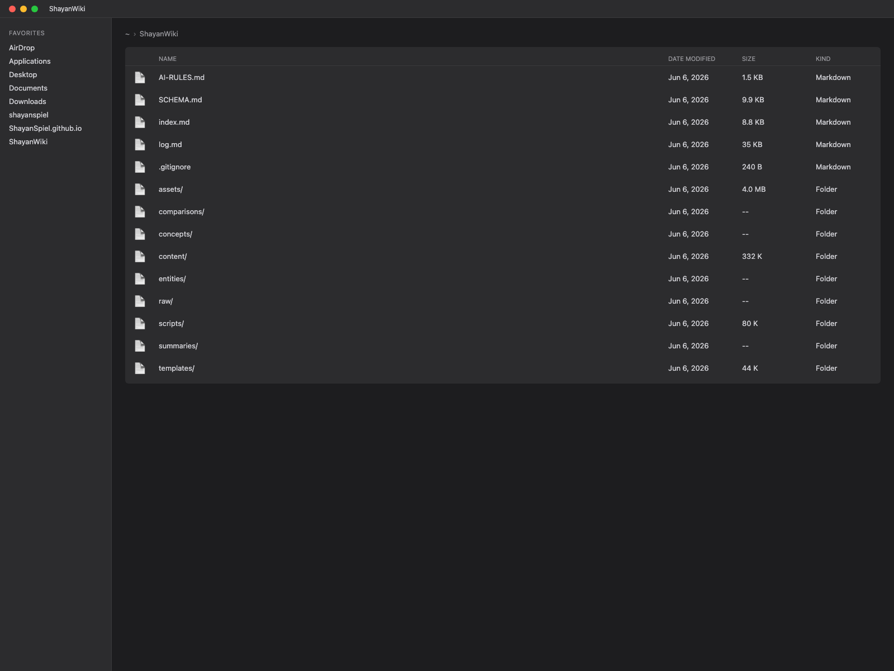
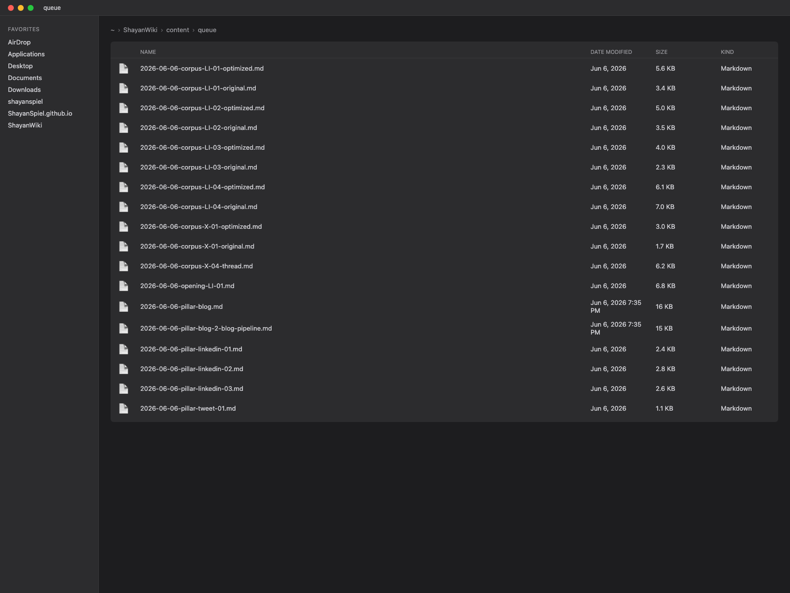
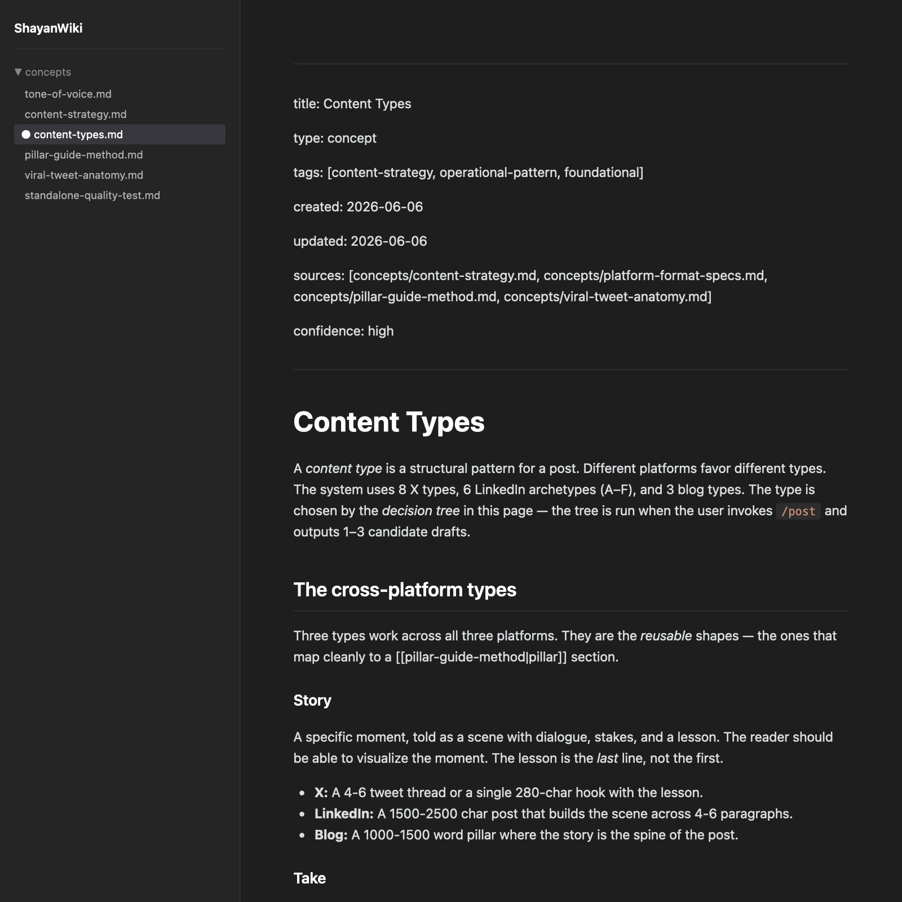
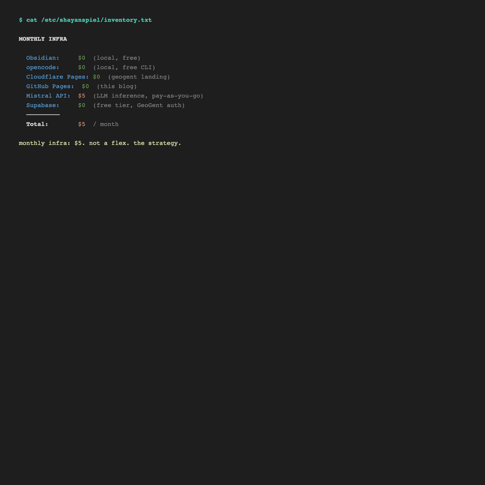
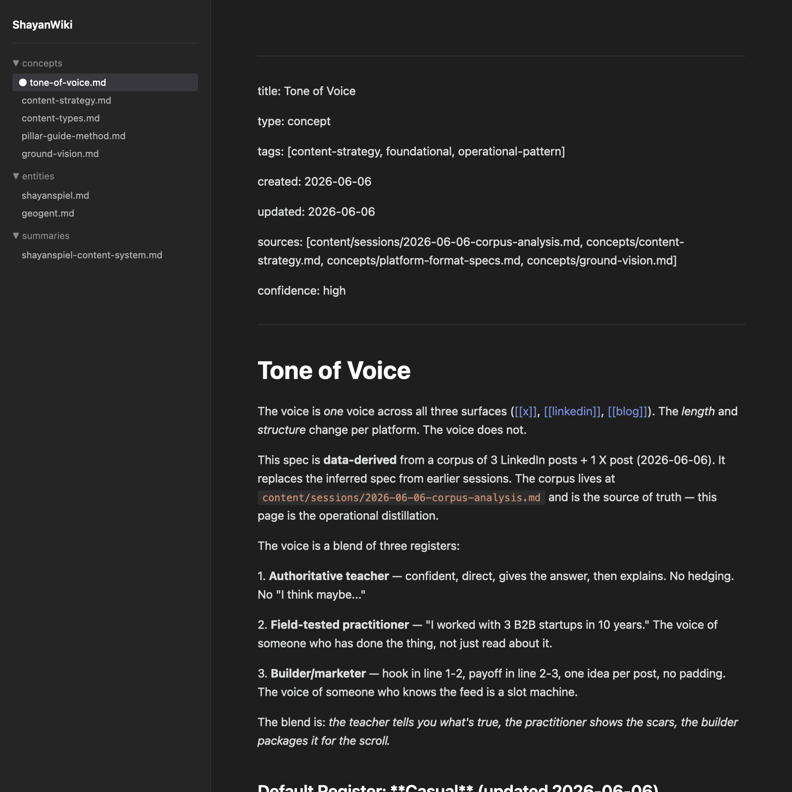
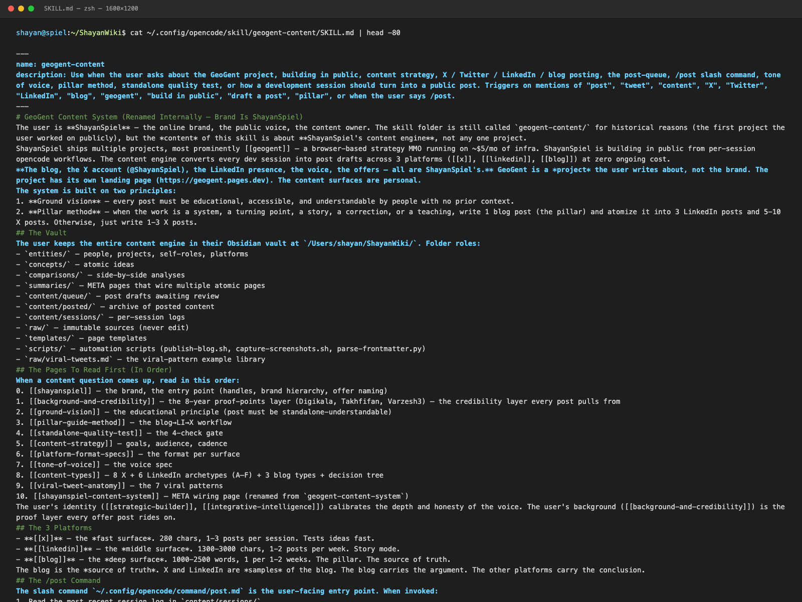

I do the work. I never post about the work. That was my problem for two years.

Every Tuesday I would finish a build session, look at the work, think "I should post about this," and not post. The reasons were always the same: I didn't know *what* to post, I didn't know *where* to start, and by Wednesday I had moved on to the next thing.

What I needed was an AI content pipeline — a system that turns build sessions into publishable drafts without switching contexts. Here is exactly how I built it.


*the vault rendered as a tree. 126 markdown files. 4 folders. no database. this is the brain — and the engine.*

This post is the architecture. Four files. One slash command. Open-source, runs on infra I already had, and turns every dev session into 2-3 post drafts at zero ongoing cost.

If you build in public, this is the system. If you don't post about your work, this is the fix.

## What a "second brain" actually is (no jargon)

A second brain is a folder of plain-text notes that an LLM can read. That's it. No database. No SaaS. No vendor lock-in. The notes are markdown. The folder is on your computer. The LLM is the only thing that needs to be smart.

The pattern is simple: every idea gets a page. Every page has *frontmatter* (a header at the top with metadata like title, type, tags). Every page links to other pages with double brackets — `like-this`. The links form a graph. The graph is the brain.

The reason this matters: when the LLM reads a page, it can also read the pages the page links to. One read becomes ten reads. The LLM gets *context* — not just the page, but the whole web of ideas around the page.

The reason this matters for content: when the LLM has context, it can write a post that *knows* the rest of your brain. The post is not a generic tweet. The post is a sample of *your* thinking, with *your* terminology, in *your* voice. That is the difference between a post and a post you would actually publish.

I keep my second brain in Obsidian. Obsidian is a free app that reads markdown files. You can use any editor. The tool is not the point. The folder of linked markdown files is the point.

## The 4-file architecture

The content engine is 4 files. That is the whole system. If your system is 40 files, you have a system, not a tool.

```
~/.config/opencode/
├── opencode.jsonc          (registers the skill + command)
├── .env                    (X / LinkedIn API keys, chmod 600)
├── skill/geogent-content/
│   └── SKILL.md            (the system spec, auto-injected into every session)
└── command/
    └── post.md             (the /post slash command)
```

That is the entire server side. The rest lives in the vault:

```
~/ShayanWiki/
├── content/
│   ├── sessions/           (one log per opencode session)
│   ├── queue/              (drafts awaiting review)
│   └── posted/             (archive of posted content)
├── concepts/               (30 atomic idea pages)
├── entities/               (people, projects, platforms)
├── raw/                    (immutable sources — never edit)
└── templates/              (page templates)
```

The flow is: at the end of a session, I run `/post`. The slash command reads the most recent session log, reads the 10 strategy pages (ground vision, pillar method, standalone test, content strategy, platform specs, tone of voice, content types, viral patterns, META), and drafts 2-3 posts. The drafts land in `content/queue/`. I open the folder, pick one, post it.


*the queue. drafts awaiting review. i open the folder, pick one, post it. the LLM drafts, i decide. the boundary is the queue.*

The system drafts. I decide. The LLM is the writer. I am the editor. The boundary is the queue.

## The decision tree (how the system picks post types)

The hardest part of "should I post this" is not the writing. It is the *type*. Is this a "ship" post? A "lesson" post? A "decision" post? The system runs a tree:

```
Did something ship?
  YES → Ship Announcement
  NO  → Was there a decision?
          YES → Decision Post
          NO  → Was there a lesson?
                  YES → Today I Learned
                  NO  → Milestone?
                          YES → Vision / Big Picture
                          NO  → Dev Log
```

The tree is a 7-node decision procedure. It takes the session log as input and outputs a single *type*. The type determines the structure. The structure determines the voice. The voice determines the post.

If the work was bigger than a session — a system, a turning point, a story — the tree outputs "pillar." A pillar is a different beast. The pillar is a 1500-2500 word blog post that becomes the *source of truth* for 3 LinkedIn posts and 5-10 X posts. The pillar is the deep one. The other platforms are samples.

This is the pillar method in one sentence: one piece of work becomes many pieces of content, all sampled from one source.


*the spec behind the decision tree. 6 LinkedIn archetypes (A-F). 8 X types. 3 blog types. one decision tree at the top. the LLM reads this page before drafting a single word.*

## Why most posts fail (the standalone quality test)

The first version of this system produced 25 X post drafts in one sitting. I was proud. I read them. Half of them made no sense.

The reason: the posts assumed context I had, that a stranger did not. A post like *"raw/ files in my second brain are SHA256-stamped"* assumes the reader knows what a second brain is, knows what a raw/ folder is, and cares about hash integrity. The reader knows none of these. The post is an inside joke.

The fix is the standalone test. Every draft must pass 4 checks:

1. **5-second test.** A stranger can extract 1 idea in 5 seconds.
2. **No-prior-episode test.** The post does not require reading earlier posts.
3. **Value-without-me test.** Replacing "I" with a stranger's name still works.
4. **Explain-to-a-friend test.** The post can be re-told in a bar without "you had to be there."

A draft that fails 1 check is fixable. A draft that fails 2+ checks is a fragment — scrap it. The system runs the test on every draft before it enters the queue. Posts that fail do not enter the queue. The queue stays clean.

The standalone test is the most important piece of the system. It is also the easiest to skip. The temptation to skip it is the temptation to ship a post that is *for you* instead of *for the reader*. The test prevents that.

This is the ground vision in practice. The reader does not know who you are. The reader does not know what you are building. The reader has 5 seconds. The post must work in those 5 seconds.

## The 3-platform model (X, LinkedIn, blog)

The system does not post to one platform. It posts to three: x, linkedin, and the blog. Each has a role.

- **X** is the *fast surface*. 280 characters. 1-3 posts per session. Tests ideas fast.
- **LinkedIn** is the *middle surface*. 1300-3000 characters. 1-2 posts per week. Story mode. Reaches builders and founders.
- **The blog** is the *deep surface*. 1000-2500 words. 1 post per 1-2 weeks. The pillar. The source of truth.

The blog is the source of truth. X and LinkedIn are *samples* of the blog. This is not a metaphor — the sampling is literal. When I write a pillar blog post, the system samples 3 angles for LinkedIn and 5-10 atomic insights for X. The samples are not new content. The samples are *extracts*. The blog carries the argument. The other platforms carry the conclusion.

The 3-platform model solves a real problem. If you only post on X, the longest post you can write is a thread. If you only post on LinkedIn, you reach a specific audience. If you only blog, no one sees it. The three platforms cover each other's gaps. The blog gives depth. X gives speed. LinkedIn gives reach. The pillar gives coherence.

## The stack (what runs it)

The whole engine runs on infra I already had. No new SaaS. No new subscription. No new credit card.

- **Obsidian** — free. Reads markdown files. Has a graph view. Has a community plugin ecosystem. The only tool I use to write the vault pages.
- **opencode** — free. The LLM CLI. Has a slash-command API. Has a skill system. The only thing that runs `/post`.
- **The file system** — free. The vault is a folder. The strategy pages are markdown. The queue is a folder. There is no database.
- **Cloudflare Pages** — free tier. Where the blog is hosted. Static site. No server.
- **X API** — $100/month for the basic tier. The X integration is optional; if you don't have it, drafts sit in the queue and you copy-paste manually. The system works without the API.

If you use the manual path (no X API, no LinkedIn API), the cost is **$0/month**. The LLM cost is minimal — a few dollars in API credits per month. The point is: the cost is negligible compared to what an agency charges for a single LinkedIn post. The asymmetry is the strategy.


*the stack rendered as text. obsidian (free) + opencode (free) + filesystem (free) + cloudflare pages (free tier) + LLM. no SaaS dependency. no new credit card. no new subscription. the proof that the system has no monthly burn.*

## Try it yourself (the 24-hour CTA)

The system is open-source. The 4 files are 4 markdown files. The whole thing is reproducible in an afternoon. Here is the order:

**Hour 1: the vault.** Set up an Obsidian vault. Create the 4 folders: `entities/`, `concepts/`, `summaries/`, `raw/`. Write 5 pages about your work — 2 entities, 3 concepts. Use the frontmatter schema. Link pages to each other with `wikilinks`. The LLM needs the graph.

**Hour 2: the strategy pages.** Write 4 pages in `concepts/`: content strategy, tone of voice, content types, ground vision. These are the pages that define *what* the system posts. The LLM needs the spec. If you cannot write the spec, the LLM cannot draft.


*one of the 10 strategy pages the LLM reads before drafting. data-derived voice spec — casual = default, polished = reserved. em-dash count, "i'm gonna" ceiling, "Actually" discourse marker. the page that makes the LLM sound like you.*

**Hour 3: the slash command.** Install opencode. Create a skill file. Create a `/post` command. Wire the slash command to read the vault, read the strategy pages, run the decision tree, and output drafts to a queue folder. Test it on a fake session.


*the `/post` slash command. 9 steps from session log to queue — read session, read strategy pages, run decision tree, draft per archetype, run standalone test, write to queue, list what was written, ask about offers, publish to blog. one slash. one queue. one edit.*


*the SKILL.md. auto-injected into every opencode session. the system spec the LLM never forgets. read this once and the LLM has the full ShayanSpiel content engine in working memory for the rest of the session.*

**Hour 4: the first real post.** Do a real work session. At the end, run `/post`. Read the drafts. Run the standalone quality test on each. Pick the best one. Post it. The system has now produced its first post.

The first post will not be perfect. The second will be better. The tenth will be on-brand. The fiftieth will be a library. The system compounds.

## Conclusion (the landing)

The whole content engine is **4 markdown files**. The whole workflow is **a slash command**. The whole output is **a queue of drafts you approve**.

The reason it works: the LLM is the writer. The LLM is good at writing. The LLM is bad at *deciding what to write*. The deciding is yours. The system takes the deciding off your plate. The writing is on autopilot.

The reason I built it: I do the work. Now I post about the work. The post is the byproduct. The work is the deliverable. The work was always the deliverable. The post is just the part the world sees.

If you have been not posting, build the 4 files. The 4 files are the system. The system is the post. The post is the audience. The audience is the leverage.

*The Spiel Engine — an AI content pipeline for developers. Open-source entry, DFY Install at $990. [github.com/ShayanSpiel/SpielEngine](https://github.com/ShayanSpiel/SpielEngine)*

## Links

**Internal (vault):**
- shayanspiel — the brand, the person writing this blog
- geogent — the most prominent project ShayanSpiel writes about (one of many subjects)
- ground-vision — the educational principle
- standalone-quality-test — the 4-check gate
- pillar-guide-method — the atomization workflow
- content-strategy — goals, audience, cadence
- platform-format-specs — the format per surface

**External (sources):**
- [Obsidian](https://obsidian.md) — the vault editor
- [opencode](https://opencode.ai) — the LLM CLI
- [X API v2 docs](https://developer.twitter.com/en/docs/twitter-api) — for the X integration

