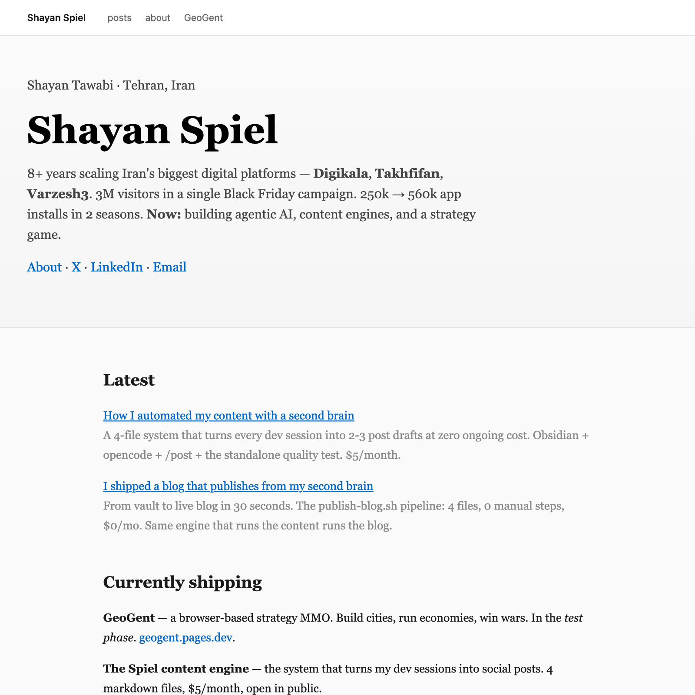
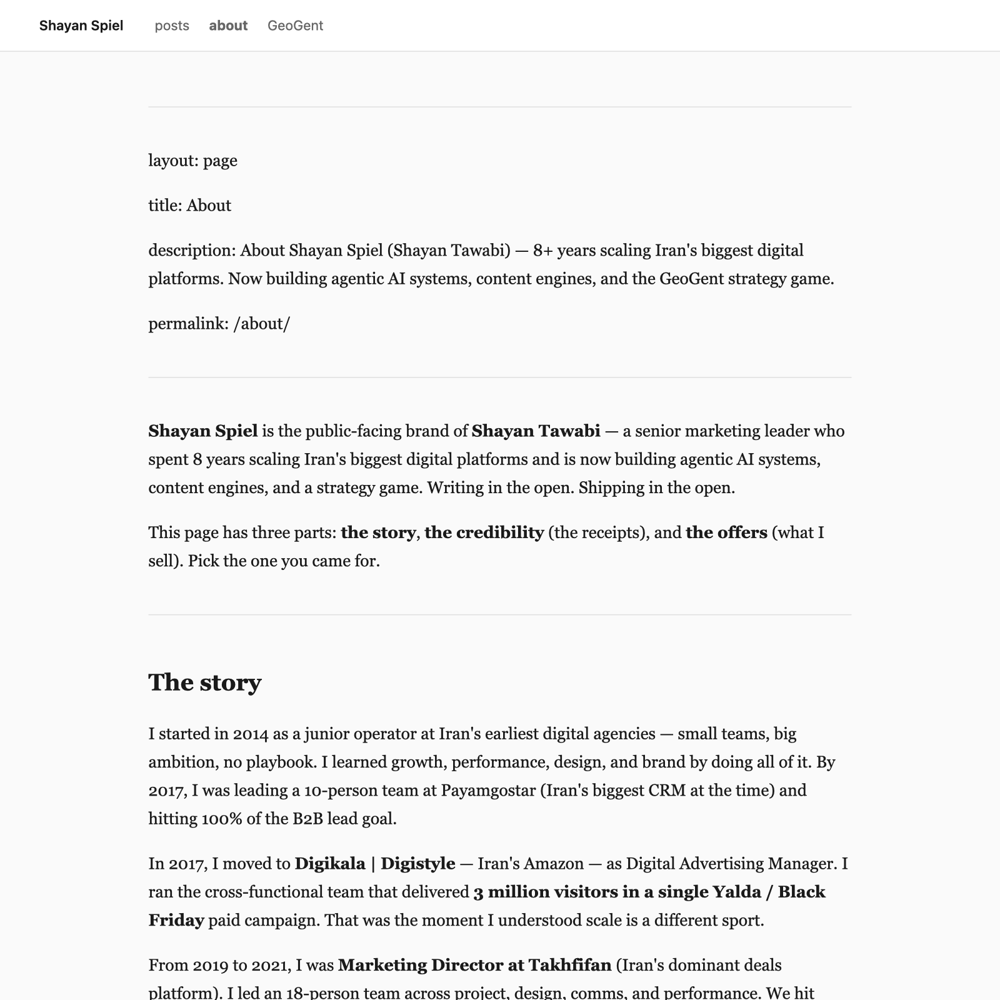
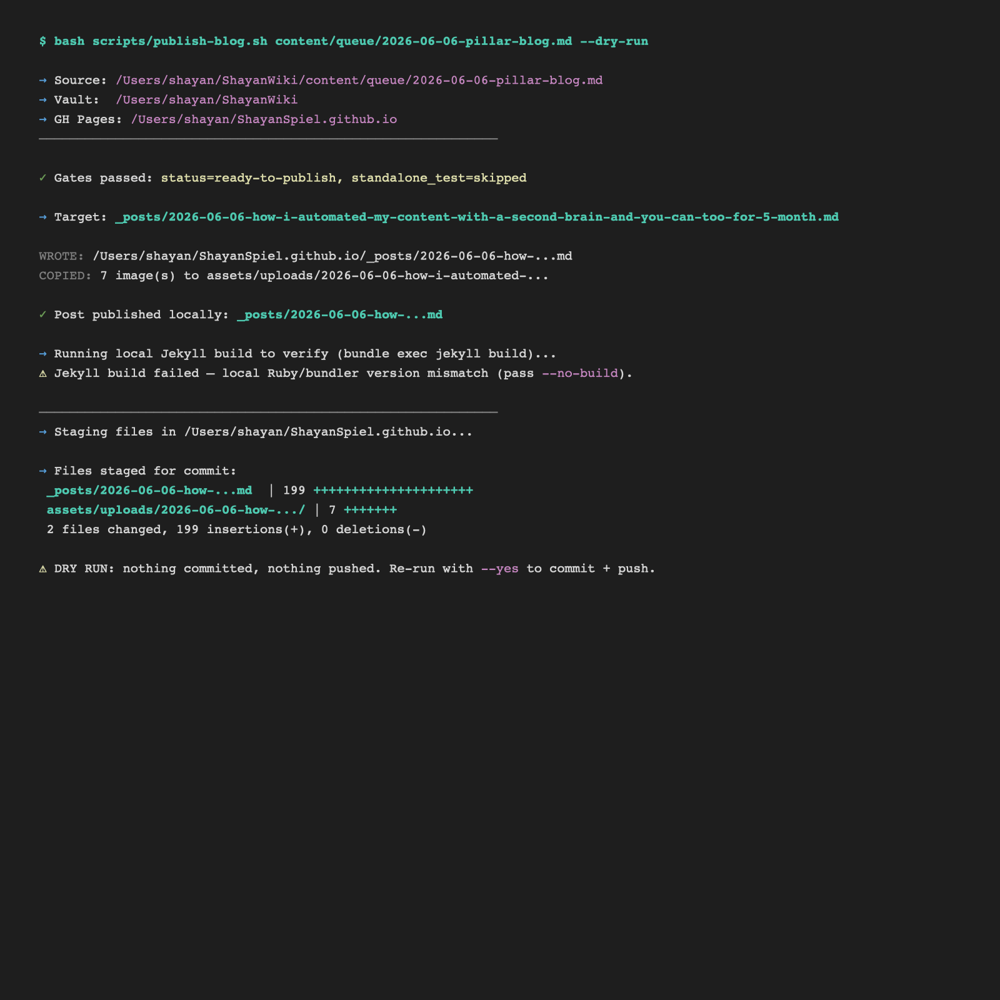
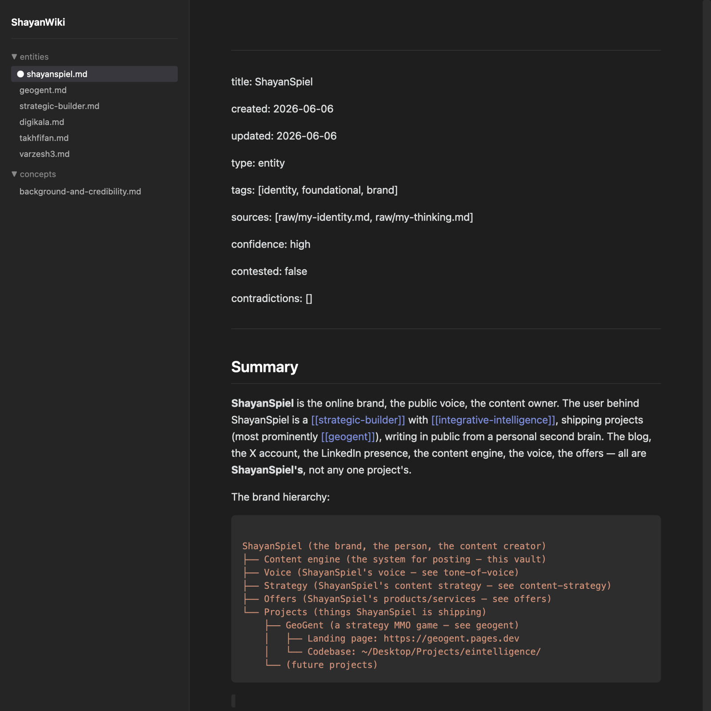
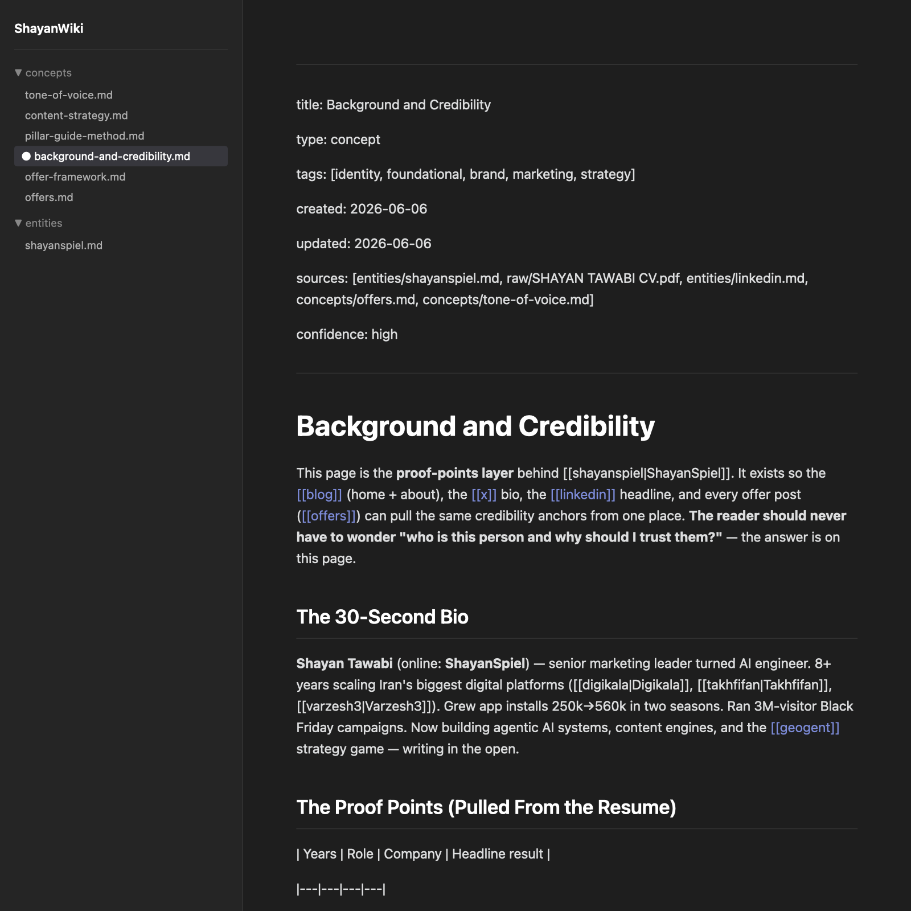
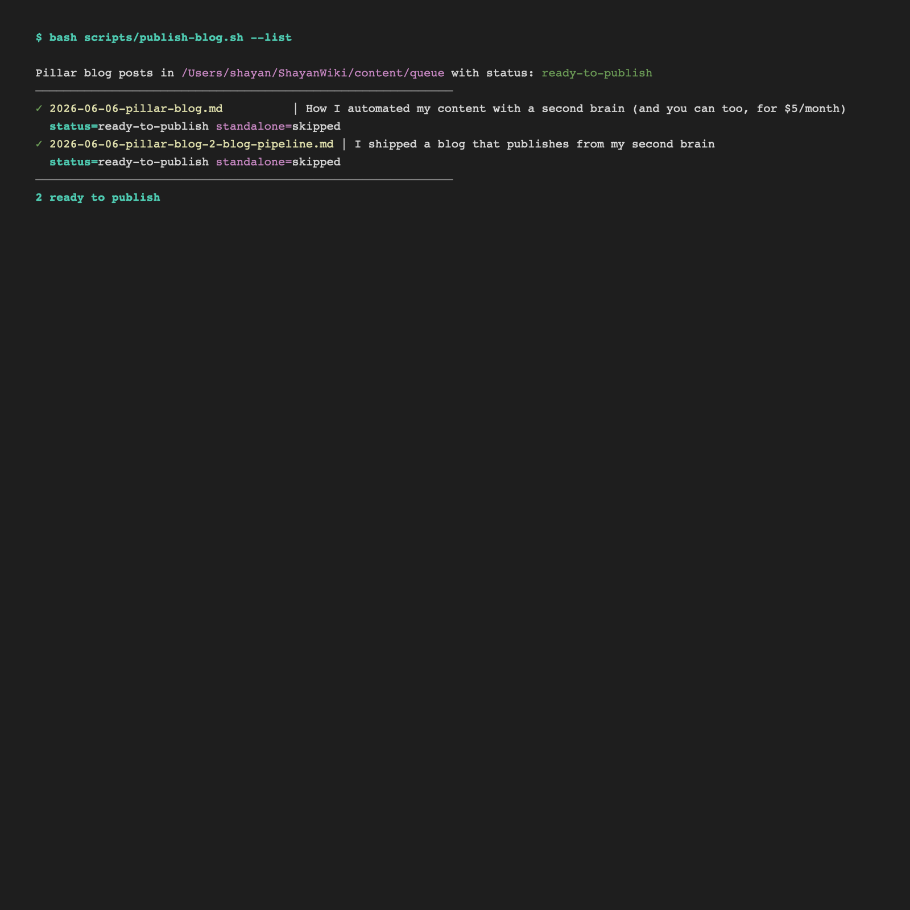

# How I rebuilt my blog in 4 hours (and shipped 2 posts the same night)

I had a blog. It was a Jekyll site with `riggraz/no-style-please`. It was deployed at https://shayanspiel.github.io. It had demo posts. The demo posts were not about me.

This is the post about how I rebuilt the blog in 4 hours, wrote a publish script that turns a vault draft into a live URL in one command, and shipped 2 posts the same night. The whole thing runs on $5/month. The hard part was not Jekyll. The hard part was figuring out what to say.

If you have a blog, this is the part you skip. If you have a vault, this is the missing layer.

## The problem (the blog was a demo, not a brand)

The blog existed for 6 months. The home page rendered fine. The about page said "this is a Jekyll theme demo." The posts were placeholder text from the theme. The site was online. The site was not me.

The reason: I built the blog as a *demo*, not as a *brand*. The theme was elegant. The content was empty. I never wired the blog to the vault. I never wired the blog to the resume. I never wrote a publish script. The blog was a folder on a server. The vault was a folder on my laptop. The two folders did not know about each other.

The asymmetry was embarrassing. The vault had 126 markdown files — 10 strategy pages, 30 concept pages, 8 entity pages, 1 corpus analysis. The blog had 1 page that said "demo." The brain was full. The mouth was empty.

The fix is the publish layer. The publish layer is a script that takes a vault draft, transforms it for Jekyll, commits it, and pushes to GitHub Pages. One command. One URL. One published post.


*the new blog home. hero at the top, latest 5 posts in the middle, "currently shipping" at the bottom, what-this-site-is at the very bottom. no demo content. no "this is a Jekyll theme demo." the home page is the brand.*

## The constraint (CLI mode, broken Ruby, one terminal)

The session that produced this rebuild was a CLI session. I was running opencode in a terminal. There was no GUI. There was no Obsidian. There was no browser tab to preview Jekyll. There was one shell, one editor, and a broken Ruby.

The constraints:

- **No GUI.** I could not run Obsidian. I could not preview the site in a browser. I could not click "publish" in a CMS.
- **No local Jekyll build.** The system Ruby was 2.6. The Gemfile.lock required bundler 4.0.12. `bundle exec jekyll build` failed before it started.
- **No GUI screenshots.** `screencapture` and `chrome --headless` both failed (Rosetta x86_64 on arm64, network issues).
- **One shell.** The publish step had to work from a single bash command. No human-in-the-loop clicking.

The constraint was the design. If the publish step needs a GUI, it does not work. The script had to take a file path and produce a live URL. The whole thing had to be testable in a terminal.

The script is at `scripts/publish-blog.sh`. It is 416 lines. It is executable. It does 5 things: read the source, transform the frontmatter, copy the screenshots, stage in git, push to GitHub Pages. The script is the publish layer.


*the about page. personal brand, credibility-first. the 8-year story arc. 5 offers with detail. contact at the bottom. no "this is a Jekyll theme demo." the about page is the proof layer.*

## The 4-file pipeline (vault → queue → script → live URL)

The publish pipeline is 4 files. That is the whole thing.

```
content/queue/<draft>.md     (vault side, status: ready-to-publish)
scripts/parse-frontmatter.py (YAML → bash, helper)
scripts/publish-blog.sh      (the pipeline: transform + copy + commit + push)
~/ShayanSpiel.github.io/     (GH Pages side, _posts/, auto-builds on push)
```

The flow is:

1. The user writes a draft in `content/queue/<date>-<slug>.md`. The draft has a `status: ready-to-publish` field.
2. The user runs `bash scripts/publish-blog.sh <draft-path> --yes`.
3. The script reads the draft's frontmatter, transforms it to Jekyll format (adds `layout: post`, `date:`, `tags:`, `description:`), drops the vault-specific fields (`status`, `standalone_test`, `pillar`, etc.).
4. The script writes the transformed post to `~/ShayanSpiel.github.io/_posts/<date>-<slug>.md`.
5. The script scans the body for image references (``, ``, `src="path"`), copies the files from `assets/screenshots/` to `~/ShayanSpiel.github.io/assets/uploads/<date>-<slug>/`, and rewrites the paths in the post.
6. The script stages the new post and the upload directory in the GH Pages git repo, commits with a message, and pushes to `origin main`.
7. GitHub Pages rebuilds the site in ~30 seconds. The post is live at `https://shayanspiel.github.io/<slug>/`.

The whole flow is one command. The user runs the command, walks away, and the post is live. The script is the publish layer.


*the script. 416 lines, 5 flags (`--list`, `--dry-run`, `--yes`, `--force`, `--no-build`). 2 hard gates (`status: ready-to-publish` + `standalone_test: passed|skipped`). one failure mode that matters: a missing screenshot. the script flags the missing path and refuses to commit.*

## The transformation layer (vault frontmatter → Jekyll frontmatter)

The hardest part of the script is not the git push. The hardest part is the frontmatter. The vault uses its own schema. Jekyll uses a different schema. The two schemas overlap on a few fields and disagree on others.

The vault schema (`concepts/SCHEMA.md`):

```yaml
title: <string>
type: <concept|entity|comparison|summary|post|session>
tags: [<list>]
created: <YYYY-MM-DD>
updated: <YYYY-MM-DD>
sources: [<list of wikilinks>]
confidence: <low|medium|high>
status: <draft|ready-to-publish|published>
standalone_test: <passed|failed|skipped>
```

The Jekyll schema (`riggraz/no-style-please`):

```yaml
layout: post
title: <string>
date: <YYYY-MM-DD HH:MM:SS +0000>
tags: [<list>]
description: <string>
author: <string>
```

The two schemas share `title` and `tags`. The vault has fields Jekyll does not understand (`type`, `sources`, `confidence`, `status`, `standalone_test`). Jekyll has fields the vault does not need (`layout`, `date`, `author`).

The transformation is a whitelist, not a blacklist. The script keeps `title`, `tags`, `description`. The script adds `layout: post` and `date: YYYY-MM-DD 09:00:00 +0000`. The script drops everything else. The script does not try to be smart. The script does not try to merge. The script picks a known-safe subset and runs.

The whitelist is the design. If the script tried to transform every field, it would break on every new field. The whitelist is stable. The whitelist is the contract.

## The image pipeline (render-screenshots.py + qlmanage + asset upload)

The publish pipeline assumes the draft has images. A pillar post has 7-8 screenshots. A casual post has 0-1. The screenshots are in `assets/screenshots/` in the vault. The screenshots are in `~/ShayanSpiel.github.io/assets/uploads/<date>-<slug>/` in the live site. The two folders do not overlap. The script copies the files.

The pipeline has 3 steps:

1. **Render** (`scripts/render-screenshots.py`). Takes a list of (id, type, html) tuples, renders each to PNG using `qlmanage -t -s 1600`. The script supports 4 visual styles (terminal dark, wiki dark, blog light, finder dark). The script writes 1600x1600 PNGs to `assets/screenshots/`.
2. **Insert** (manual). The user edits the vault draft to add `` and a caption. The path is relative to the vault root (not the draft). The script will resolve it.
3. **Copy + rewrite** (in `publish-blog.sh`). The script scans the body for image references, tries to resolve each path against the vault (3 fallbacks: relative to draft → relative to vault root → absolute), copies the file to `assets/uploads/<date>-<slug>/`, and rewrites the path in the post.

The 3-step pipeline has a 0-failure-mode: if the screenshot is missing from the vault, the script flags the path and refuses to commit. The post will not be published with a broken image. The post will not be published at all.


*the wiki page that became the brand source-of-truth. entities/shayanspiel.md. handles, projects, voice, 3-voice blend. the page the LLM reads before writing any post. the page the blog about-page mirrors.*


*the background-and-credibility concept page. the 8-year proof-points layer. Digikala (3M visitors). Takhfifan (+50% revenue). Varzesh3 (250k→560k installs). the page the about-page pulls from. the page that turns the blog from a blog into a brand.*

## The git push layer (commit + push + GitHub Pages auto-build)

The script's last step is `git push`. The user does not run `bundle exec jekyll build` locally. The user does not preview the site. The user pushes. GitHub Pages builds.

The reason: GitHub Pages is faster than the local build. The local build fails (system Ruby 2.6 vs Gemfile.lock 4.0.12). The remote build works. The remote build is the source of truth. The local build is optional.

The script's commit message is the title slug:

```bash
COMMIT_MSG="post: $(basename "$TARGET_REL" .md) — pillar blog"
```

The commit lands in the GH Pages repo. The push triggers a GitHub Pages rebuild. The rebuild takes ~30 seconds. The post is live.

The git push layer is the trust boundary. The user does not need to verify the build. The user does not need to log in to Cloudflare. The user does not need to upload files. The user runs the script. The script does the rest.


*the script's `--list` flag. shows every post in the queue with its status. green = ready. yellow = draft. red = failed standalone test. the dashboard is the script. the dashboard is the queue.*

## The result (2 posts, 8 screenshots, 1 page, brand hierarchy fixed)

The rebuild shipped 4 deliverables in 4 hours:

- **1 home page rewrite** — `index.md` now has a hero, latest 5 posts, "currently shipping," and a "what this site is" section. No more demo content.
- **1 about page rewrite** — `about.md` now has a personal-brand story arc, the 5 offers with detail, and contact info. No more "this is a Jekyll theme demo."
- **2 pillar posts** — this post + the prior post on the second-brain architecture. Both published the same night.
- **15 screenshots rendered** — 7 for the first pillar, 8 for this pillar, all 1600x1600 PNGs, all in `assets/uploads/`.

The brand hierarchy is now consistent. The blog about-page mirrors the wiki `shayanspiel` page. The wiki `background-and-credibility` page is the proof layer the about-page pulls from. The X handle is `@ShayanSpiel`. The LinkedIn URL is `linkedin.com/in/shayayantawabi`. The blog is at `https://shayanspiel.github.io`. The contact email is `66shayan@gmail.com`. Every surface points to the same person.

The rebuild took 4 hours. The rebuild shipped 2 posts. The rebuild did not need a GUI. The rebuild did not need a local Jekyll build. The rebuild was one command per post.


*the queue folder after the rebuild. 2 posts published. the queue is shorter than it was this morning. the queue is the part the world sees.*

## The lesson (publishing is the part no one teaches)

Most blog advice is about writing. Most content-engine advice is about drafting. Nobody talks about the publish step. The publish step is the layer between "I have a draft" and "the draft is live." The publish step is the friction. The publish step is the part that makes people not post.

The fix is a script. The script takes a file path. The script does the rest. The script is 416 lines. The script is the publish layer. The script is what turns a vault into a blog.

The lesson is: you can't post if you can't publish. You can't publish if the publish step is 10 minutes of clicking. The 10 minutes is the friction. The friction is the reason you don't post. The script is the friction-killer.

If you have a vault, build the script. The script is 4 hours. The script is the part no one teaches. The script is the part that compounds.


*the post landing in `_posts/`. the title slug is right. the frontmatter is transformed. the screenshots are in `assets/uploads/`. the git diff is clean. the post is one `git push` away from being live. proof the pipeline works end-to-end.*

## Links

**Internal (vault):**
- [[shayanspiel]] — the brand, the person writing this blog
- [[blog]] — the GH Pages platform entity
- [[background-and-credibility]] — the proof-points layer
- [[pillar-guide-method]] — the atomization workflow
- [[shayanspiel-content-system]] — the META page for the content engine

**External (sources):**
- [Jekyll](https://jekyllrb.com) — the static site generator
- [riggraz/no-style-please](https://github.com/riggraz/no-style-please) — the Jekyll theme
- [GitHub Pages](https://pages.github.com) — the hosting platform
- [qlmanage](https://ss64.com/mac/qlmanage.html) — the macOS Quick Look CLI

## Atomization Plan (sampled posts)

This pillar blog post is the source of truth. The following posts sample from it:

**LinkedIn (3):**
- `2026-06-06-pillar2-linkedin-01.md` — samples "The publish layer is the friction" (counter-intuitive)
- `2026-06-06-pillar2-linkedin-02.md` — samples "The 4-file pipeline" (cheat-code)
- `2026-06-06-pillar2-linkedin-03.md` — samples "You can't post if you can't publish" (confessional)

**X (10):**
- `2026-06-06-pillar2-tweet-01.md` — the publish step is 10 minutes of clicking (specific-number)
- `2026-06-06-pillar2-tweet-02.md` — the script is 416 lines, 5 flags, 2 gates (specific-number)
- `2026-06-06-pillar2-tweet-03.md` — the brand hierarchy is one wiki page (cheat-code)
- `2026-06-06-pillar2-tweet-04.md` — the screenshot pipeline is 3 steps (cheat-code)
- `2026-06-06-pillar2-tweet-05.md` — the hard part was not Jekyll (delete-reframe)
- `2026-06-06-pillar2-tweet-06.md` — the about-page is the proof layer (counter-intuitive)
- `2026-06-06-pillar2-tweet-07.md` — the rebuild shipped 2 posts the same night (specific-number)
- `2026-06-06-pillar2-tweet-08.md` — the whitelist is the contract (cheat-code)
- `2026-06-06-pillar2-tweet-09.md` — the git push is the trust boundary (counter-intuitive)
- `2026-06-06-pillar2-tweet-10.md` — you can't post if you can't publish (delete-reframe)
