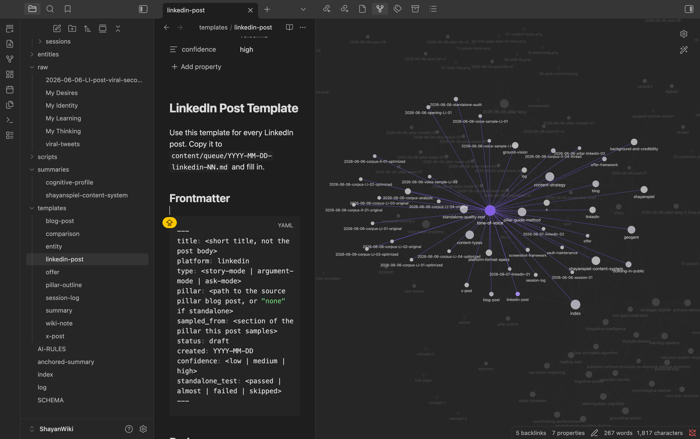

A year ago i built a prompt. 2000 words. Every rule i could think of.

"always check. never overwrite. link to 2 pages minimum. update the index. log everything."

The model read it. nodded. and ignored half of it.

This is not a model problem. It is an architecture problem. You built a constitution, not a government. And everyone building with LLM agents hits the same wall.

Here is the loop that fixed it, the industry framing everyone in the agentic-AI space is talking about, and why prompt engineering is the past but agentic loops are the future.


---

## Every AI system needs a loop

The industry has been obsessed with prompts for 2 years. Bigger prompts. Structured prompts. Role-based prompts with 15 paragraphs of "you are an expert."

But the systems that actually work follow a different pattern. They follow a loop:

**Act → Observe → Evaluate → Update → Repeat**

That is the only thing that matters. Not the prompt. The loop.

A prompt is a static document. A loop is a dynamic process. The first breaks under context pressure. The second survives it.

## What the loop looks like in practice

The system i built runs two loops that feed each other. Here is the first one:

```
/extract → INGEST → ANALYZE → RECONCILE → INDEX → VALIDATE → IDLE
```

Each state is one step in the loop.

- **Act:** INGEST a raw source file, ANALYZE its entities, RECONCILE against existing pages
- **Observe:** check the validation gates — does the page have frontmatter? do the links work?
- **Evaluate:** score the output. Pass or fail.
- **Update:** write the new page, log the action, bump the state file
- **Repeat:** next source file or back to IDLE

The same pattern powers the content engine (full spec in [AGENTS.md](https://github.com/ShayanSpiel/SpielEngine/blob/main/AGENTS.md)):

```
/post → SESSION → STRATEGY → DRAFT → GATES → QUEUE → REVIEW? → PUBLISH → ARCHIVE → ANALYZE → IDLE
```

Two loops. One architecture. The Act→Observe→Evaluate→Update→Repeat pattern is the same.

## Why loops beat prompts

A prompt does not recover from failure. If the model ignores line 47 of your prompt, nothing catches it. The output is wrong. You notice hours later.

A loop catches failure at every transition.

Each state has a validation gate. Before moving to the next state, the model checks: did the action work? If no, it stays in the current state and retries or reports. There is no "silently wrong" output.


This is the difference between a system that looks like it should work and a system that actually works.

## The gate is the innovation

Here is the smallest possible example of the loop pattern replacing the prompt pattern:

**Prompt pattern (what everyone writes):**
"NEVER create a page for passing mentions. Only create pages when a concept appears in 2+ sources."

**Loop pattern (what actually works):**
"Before creating a page: check if concept is in 2+ sources → if yes, create → if no, check if it is central to one source → if yes, create → if no, skip and log."

The first is a prohibition the model must hold across time. The second is a decision tree the model executes right now. Models are bad at the first and good at the second.

## The human toggle

Here is the other thing loops enable that prompts cannot: conditional human involvement.

The loop has a decision point after QUEUE:

```
QUEUE → REVIEW?
         │
    toggle OFF ──→ PUBLISH
    toggle ON  ──→ wait for human
```

Three modes: manual (always show me), auto-threshold (publish if quality score is high enough), auto-always (zero human review, opt-in only).

A prompt cannot do this. A prompt cannot say "if quality is above 0.85, proceed, otherwise pause." A prompt is static. A loop is dynamic.

## The real insight

Prompt engineering is the past. Agentic loops are the future. The industry is figuring this out right now. The people building with state machines and execution gates are shipping. The people still optimizing their 3000-word system prompt are stuck.

Do not build a bigger prompt. Build a loop.

If you want to start from a blank template: the [SpielEngine repo](https://github.com/ShayanSpiel/SpielEngine) has the full state machine, 18 slash commands, and quality gates as a starter kit.



Note: i absolutely wrote the big prompt first. i spent months adding rules to it. The day i replaced it with a 200-line state machine was the day the system started working. The model did not change. The architecture did.

What is the one rule you wrote that your model kept ignoring? Drop it in the comments.
