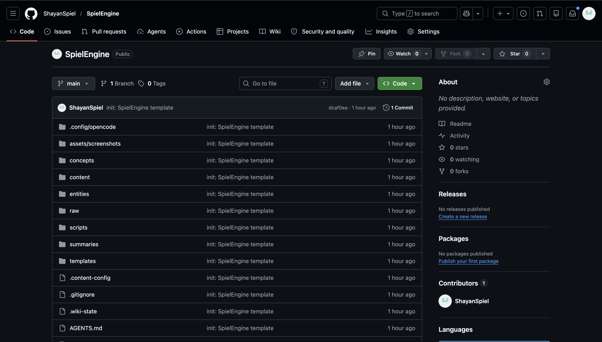

I ship consistently. Before the engine, I did not.

Every Tuesday I would finish a build session, look at the work, think "I should post about this," and not post. Not because I could not write. Because writing meant switching from builder to creator. That switch never happened.

Here is the open-source AI writing pipeline that removed the switch.

**[SpielEngine](https://github.com/ShayanSpiel/SpielEngine) turns your build sessions into publishable content, so you never need to stop working to create posts.**

---

## Here is what that looks like

A two-hour debugging session becomes a post. You never open a writing tool.

**Session log (2 minutes of notes after building):**

```
Spent 2 hours fixing context drift in a LangGraph workflow.
Root cause: too many hidden state transitions between nodes.
Fix: explicit state schema with required fields per transition.
```

**Generated post:**

```
Most AI agents don't fail because of prompting.
They fail because nobody knows what state they're in.

Every hidden transition is a drift point.
Every drift point is a silent bug.

Make the state explicit.
The agent will thank you.
```

Same session. Different frame. Extracted, not written.

That is the mechanism. **Your work session is the content. The engine extracts what is already there.**

---

## How it works

Two state machines run independently, one for compound knowledge, one for publishing.

**Wiki loop** ingests raw notes, extracts entities, reconciles into wiki pages, links them. A knowledge base that grows with every session.

```
IDLE → INGEST → ANALYZE → RECONCILE → INDEX → VALIDATE → COMPLETE
```

**Content loop** takes a session or topic, classifies it by archetype and funnel stage, runs the 8-step Compiler (core insight → 6 meanings → selected angle), drafts to blog/LinkedIn/X, gates every draft, and queues for your review.

```
IDLE → SESSION → STRATEGY → COMPILE → DRAFT → GATE → QUEUE → PUBLISH
```

LLM handles the creative steps (analyzing, drafting, gate-judging). Scripts handle the mechanical steps (transitions, file ops, API calls). The two never overlap.

Every draft passes 16 mechanical gates (char count, hook, audience, frontmatter, word repetition...) plus an LLM-judged 14-gate creative test. Composite score must hit 0.85. Failing drafts do not enter the queue.

---

## What you get

Clone the repo and you get the engine I run daily:

- **19 slash commands**, `/extract`, `/post`, `/publish`, `/state`, `/health`, `/config`, `/optimize`, `/prune`, and 11 more. Each is a markdown file your agent reads at invocation.
- **SETUP.md**, a self-contained setup prompt. Paste it into any LLM agent. The agent auto-detects your platform (opencode, Cursor, Claude Code, Continue), installs all commands and skills, and runs a 14-question ICP/voice/brand setup. No manual file copying.
- **AGENTS.md**, the state machine that governs both loops. Read it in 10 minutes, customize in 30.
- **8 templates**, blog, LinkedIn, X, concept, entity, summary, comparison, session-log. Each with the right frontmatter.
- **Content Engine Compiler**, an 8-step pipeline that extracts core insight, 6 meanings, and a selected angle from every session.
- **Strategy classifier**, maps every session to 1 of 10 archetypes (S1-S10), each with a vertical, funnel stage, and ICP layer.
- **16 mechanical gates + 14 creative gates**, automated quality checks at every transition.
- **Platform API clients**, `post_x.py` and `post_linkedin.py` for direct publishing.
- **Banner generator**, `banner.py` auto-generates post banners with your branding.
- **Health scripts**, detect orphans, broken links, stale pages, redundancy.
- **Full directory scaffold**, `concepts/`, `templates/`, `scripts/`, `content/sessions/`, `content/queue/`, `content/posted/`, `raw/`, `notes/`, `assets/`, `.opencode/commands/`, `.opencode/skill/`, `logs/`.

Requirements: Python 3, bash, git. Everything else is optional. No npm. No Docker.



---

## Setup: clone + paste

**Step 1.** Clone the repo:

```bash
git clone https://github.com/ShayanSpiel/SpielEngine my-engine
cd my-engine
```

**Step 2.** Open `SETUP.md` in any LLM-powered agent (Cursor, Claude Code, opencode, Continue, ChatGPT). Copy the prompt block and paste it.

**Step 3.** The agent reads every file, detects your platform, installs all commands and skills, creates the directory structure, and runs a 14-question setup, your brand name, ICP, offer, voice, content verticals, CTAs. It writes every config file: `concepts/icp-offer.md`, `voice-corpus.md`, `funnel-and-matrix.md`, `rules.yaml`, `brand-config.json`.

**Step 4.** Run your first command:

```bash
# Check the system is alive
/state

# Ingest raw material
/extract my-notes.md

# Generate posts from your session
/post "my first session"

# Check health
/health
```

The whole setup takes one paste and ~15 minutes of answering questions. After that, the engine is wired to your workflow.

---

## The two-layer system

| Layer | What | Price |
|-------|------|-------|
| **1. Open Source** | The repo, methodology, pipeline, clone, paste, customize | Free |
| **2. DFY Install** | Full pipeline installed inside your workflow, positioned to your voice, with 30 days of review | $990 one-time |

**Layer 1** is what you get from this repo. It is the engine I run daily. Clone it, paste the setup prompt into your agent, answer 14 questions, and you have a working content pipeline in an afternoon.

**Layer 2** is for founders who want the full system without touching a config file. I install the complete pipeline inside your workflow, positioning strategy, offer design, bio rewrite, agents and templates in your voice, workflow design, 3 sample pillars ready to publish, and 30 days of post-publish review where I read every draft and refine the engine.

The guarantee: if after 30 days you have run 5 sessions and do not have 5 gated drafts in your queue, I refund 100%, and you keep the system.

3 slots per month. Hard cap.

[Apply for the DFY Install →](/contact/)

---

## Why this exists

I built this for myself first. The repo was extracted from my working vault after months of iteration. The templates are the ones I use every day. The commands are the ones I ship with. There is no theory here, every file has been tested in production.

The insight is simple: you should never "go create content." Your work should already contain it. The engine extracts what is already there.

If you ship and do not post, this is the system that fixes it.

Clone the repo: **[github.com/ShayanSpiel/SpielEngine](https://github.com/ShayanSpiel/SpielEngine)**

Star it, open an issue, or [DM me on X](https://x.com/ShayanSpiel) if you want the DFY Install.
