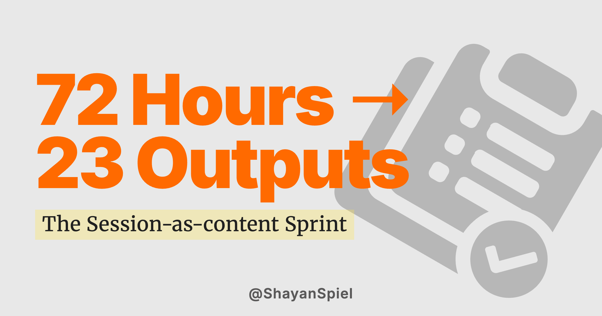

*3 days, 23 outputs, one system.*

# I Spent 72 Hours Rebuilding How I Ship Content → I Ended Up With 23 Outputs

For a long time, I kept running into the same problem:

I would finish building something, close the session, and the output would basically disappear.

Not literally - the code was there, the ideas were there - but nothing _carried forward_ into content, writing, or distribution.

So the next day, I’d start again from zero.

That disconnect became the real bottleneck. Not writing. Not ideas. Just capture.

So I ran a 72-hour experiment to fix it.

I didn’t try to “be more productive.”

I rebuilt the system that turns work into output.

---

## What happened in 72 hours

By the end of the sprint, I had:

- 4 published blog posts
- 3 LinkedIn posts automatically published
- 18 reusable system commands
- 2 core workflow loops rebuilt
- ~85 draft outputs queued for refinement
- A knowledge vault that expanded from ~10 pages to ~40 structured pages

But the numbers are not really the point.

The real change is this:

Now every session I run produces something that survives it.

---

## The real problem wasn’t content - it was loss

Before this, every work session had the same ending:

- I built something
- I learned something
- I moved on

But nothing was captured in a way that could be reused.

So even when I was productive, I wasn’t accumulating leverage.

That’s what I tried to fix.

---

## What I changed

I rebuilt my workflow into a simple structure:

### 1. A knowledge layer (the vault)

Instead of scattered notes, everything now becomes a structured file:

- one idea = one page
- each page has sources, tags, and connection    
- everything is cross-linked

The goal is simple:  
my system should understand what I already know.

This is the same principle behind the [session-as-content methodology](/session-as-content/) — every build session produces durable knowledge.

---

### 2. A repeatable execution layer

Instead of random scripts and ad-hoc actions, I turned everything into small, single-purpose commands.

Each command does one thing:

- write
- classify
- publish
- archive
- extract

No multi-purpose “magic scripts.”

Just predictable building blocks.

---

### 3. A content pipeline with stages

Every piece of content now has a job.

I stopped treating everything as “a post” and started classifying output:

- **Awareness (TOFU):** introduces ideas
- **Mechanism (MOFU):** explains how it works
- **Conversion (BOFU):** connects to the offer

This changed something important:

I stopped trying to make every post do everything.

Each piece now has a single responsibility.

I wrote about how this pipeline evolved from [declarative rules to agentic loops](/from-declarative-rules-to-agentic-loops/) — the same system that runs this classification.

---

## What broke during the sprint

Not everything worked.

At first, I over-engineered the system.

- The rules got too complex and started fighting each other
- Some drafts sounded robotic instead of human
- The system started overwriting things I actually needed to keep

So I simplified aggressively.

I reduced the rule system by more than half and enforced one principle:

If it doesn’t help output, it doesn’t stay.

That fixed most of the noise.

---

## What I learned

### 1. Output is not the hard part — retention is

Most people don’t lack ideas.

They lose them.

The real advantage comes from building something that preserves what you produce and feeds it back into the next session.

---

### 2. Structure creates velocity

I used to think structure slows you down.

In reality, the opposite is true.

Once I had:

- clear stages
- clear commands
- clear roles for each output

decisions became almost automatic.

No hesitation. No overthinking.

---

### 3. Constraints improve clarity

The moment I forced every piece of content into a role (TOFU / MOFU / BOFU), quality actually increased.

Because I stopped trying to say everything at once.

---

### 4. Systems matter more than effort

This sprint didn’t work because I worked harder.

It worked because less of my output was getting lost.

That changed the compounding effect.

---

## What this actually became

At first, this was just a personal experiment:

“How do I stop losing my work every day?”

But it evolved into something more:

A system where:

- thinking produces structure
- structure produces content
- content feeds back into thinking

So instead of isolated sessions, I now have continuity.

That’s the real win.

---

## What I’m still figuring out

This is not finished.

Some parts are still messy:

- voice consistency still needs work
- some automation is still overkill
- not every piece of output deserves to exist

But the loop itself is working now.

And that matters more than perfection.

---

## If you take one thing from this

You don’t need to “produce more content.”

You need a system where nothing you produce disappears.

That system is exactly what I build for founders. If this resonates, [let's talk](/about/).

Because once output accumulates instead of evaporating, everything compounds.
