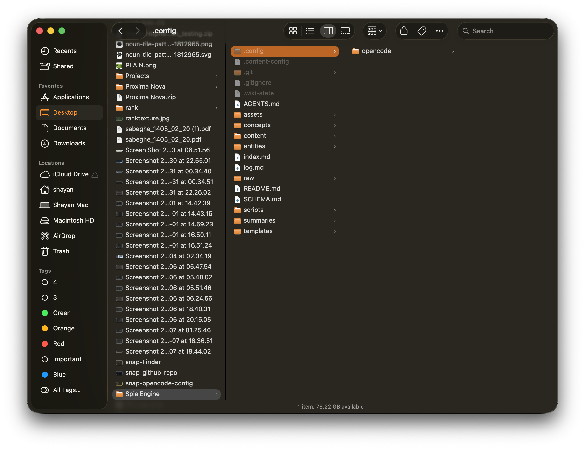
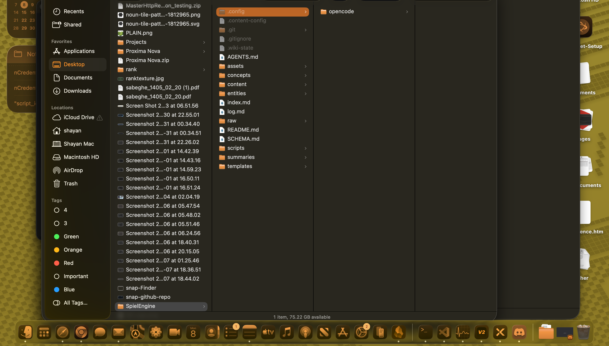
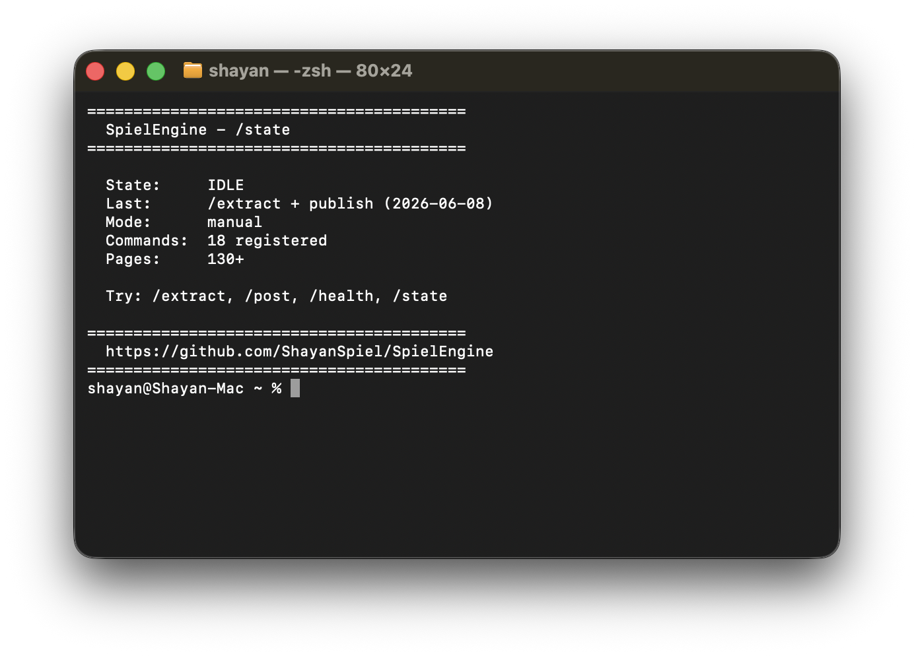
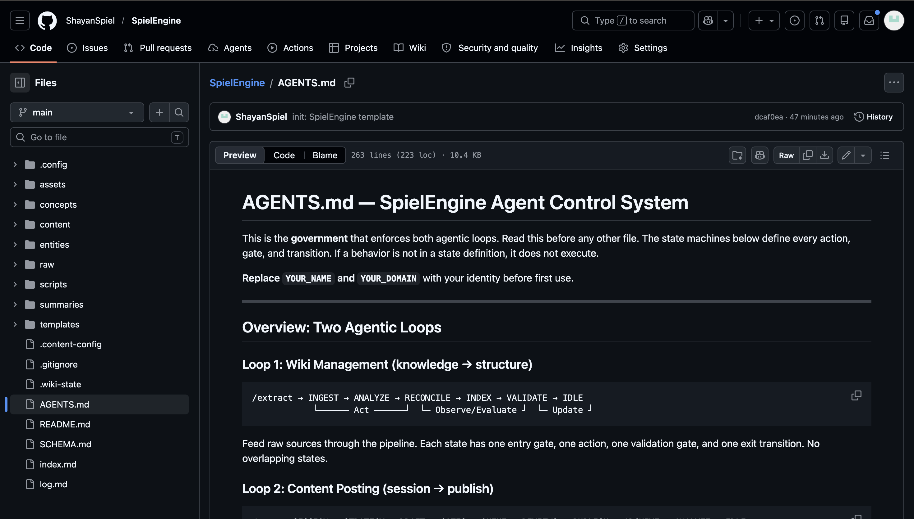

<div class="notice-banner">
  <strong>⚠️ TheSpielEngine is undergoing change.</strong> Use the repository only as an overall structure. Changes will be announced shortly.
</div>

Two days ago i published a post called [From Declarative Rules to Agentic Loops](/from-declarative-rules-to-agentic-loops/). It was about the architecture that finally made my LLM-operated wiki work — state machines, validation gates, and a loop instead of a prompt.

The response was: "where is the template?"

It did not exist yet. So i built it. Here it is.

**[SpielEngine](https://github.com/ShayanSpiel/SpielEngine) is an open-source starter kit for building an agentic wiki.** The state machine, the commands, the quality gates, the templates — everything that runs my system, packaged as a template you can clone in 10 seconds and customize in 10 minutes.


---

## What you get

The repo is at [github.com/ShayanSpiel/SpielEngine](https://github.com/ShayanSpiel/SpielEngine). Clone it and you get:

- **AGENTS.md** — the state machine that governs the entire system. Two loops (wiki management + content posting), 18 states, validation gates at every transition.
- **18 slash commands** — `/extract`, `/post`, `/publish`, `/health`, `/state`, and 13 more. Each is a markdown file that your LLM reads at invocation.
- **A SKILL.md** — the content engine skill that auto-injects into every opencode session.
- **7 templates** — concept, entity, summary, blog, LinkedIn, X, session-log.
- **2 health scripts** — wiki-health.py (orphans, broken links, stale pages) and detect-redundancy.py (content overlap).
- **Full directory scaffold** — raw/, concepts/, entities/, summaries/, content/queue/, content/posted/, content/sessions/, assets/screenshots/, scripts/.

---

## Step 1: Clone the repo

```bash
git clone https://github.com/ShayanSpiel/SpielEngine my-agentic-wiki
cd my-agentic-wiki
```

That is it. The template is ready. Every file is a starting point — replace the placeholder content with your own.

---

## Step 2: See the structure

The directory layout is designed for how LLMs read, not how humans organize. Flat enough to navigate, deep enough to scale.



| Directory | What it holds |
|-----------|--------------|
| `raw/` | Source materials — articles, transcripts, notes |
| `concepts/` | Evergreen wiki pages — ideas, patterns, guides |
| `entities/` | Entity pages — people, platforms, projects |
| `summaries/` | Overview/synthesis pages |
| `templates/` | Templates for pages and posts |
| `content/queue/` | Drafts awaiting review or publish |
| `content/posted/` | Published content archive |
| `content/sessions/` | Session logs |
| `assets/screenshots/` | Screenshot captures |
| `scripts/` | Health check scripts |
| `.config/opencode/` | opencode skill + command files |

---

## Step 3: Install in opencode

If you use [opencode](https://opencode.ai), installation is symlinks or copy:

```bash
# Copy the skill
cp -r .config/opencode/skill/shayanspiel-content ~/.config/opencode/skill/

# Copy the commands
cp .config/opencode/command/* ~/.config/opencode/command/

# Register everything in opencode.jsonc
cp .config/opencode/opencode.jsonc ~/.config/opencode/opencode.jsonc
```

The `opencode.jsonc` registers 18 commands (`/extract`, `/post`, `/publish`, etc.) and the content skill. Each command points to `AGENTS.md` as its template — so your LLM reads the state machine every time you invoke a command.



Then restart opencode and run `/state` to see the system is alive:



---

## Step 4: Install in Claude Code

If you use [Claude Code](https://docs.anthropic.com/en/docs/claude-code/overview), setup is even simpler. Claude Code reads `CLAUDE.md` from the project root for system instructions.

Create a `CLAUDE.md` in your wiki root:

```markdown
# Project Instructions

This is an agentic wiki powered by SpielEngine. 
Read AGENTS.md before any other file — it defines the state machine 
that governs all operations.

## Quick start
- /extract [source] — ingest a raw source → wiki page
- /post [about] — convert session work into drafts
- /health — run validation checks
- /state — show current system state
```

Claude Code will read this at session start and load the full state machine from `AGENTS.md`. No plugins, no config files.

The same works for any LLM-based coding tool (Cursor, Windsurf, Cline, etc.) — point it at `AGENTS.md` and it follows the same loop.

---

## Step 5: Run your first command

```bash
# Check the system state
/state
# State: IDLE, Ready for next command

# Ingest your first source
/extract my-first-article.md
# INGESTING → ANALYZING → RECONCILING → INDEXING → VALIDATING → COMPLETE

# Create content from your session
/post
# SESSION → STRATEGY → DRAFT → GATES → QUEUE

# Validate the wiki
/health
# Orphans: 0, Broken links: 0, Stale: 2
```

Each command follows the state machine. The model never guesses what to do next — the state machine tells it.

---

## What you are getting

This is not a product. It is a starting point.

- **The state machine** ([AGENTS.md](https://github.com/ShayanSpiel/SpielEngine/blob/main/AGENTS.md)) is 200 lines of markdown. Read it in 10 minutes. Customize it in 30.
- **The skill** ([SKILL.md](https://github.com/ShayanSpiel/SpielEngine/blob/main/.config/opencode/skill/shayanspiel-content/SKILL.md)) is 60 lines. Your content engine contract.
- **The commands** ([18 files](https://github.com/ShayanSpiel/SpielEngine/tree/main/.config/opencode/command)) are one page each. Each is a state transition in markdown.
- **The templates** ([7 files](https://github.com/ShayanSpiel/SpielEngine/tree/main/templates)) are blank slates with the right frontmatter.



---

## Why this matters

The previous post explained why prompts fail and loops work. SpielEngine is the concrete implementation of that idea. The state machine, the gates, the cross-loop feedback — they are all in that repo.

The insight is the same: prompt engineering is the past, agentic loops are the future. But this time you do not have to build the loop from scratch. Just clone it.

---

Note: i absolutely built this for myself first. The repo was extracted from my working vault after 2 months of iteration. The templates are the ones i use every day. The commands are the ones i ship with. There is no theory in this repo — every file has been tested in production.

Are you going to try it? Drop a comment or open an issue on the repo.

