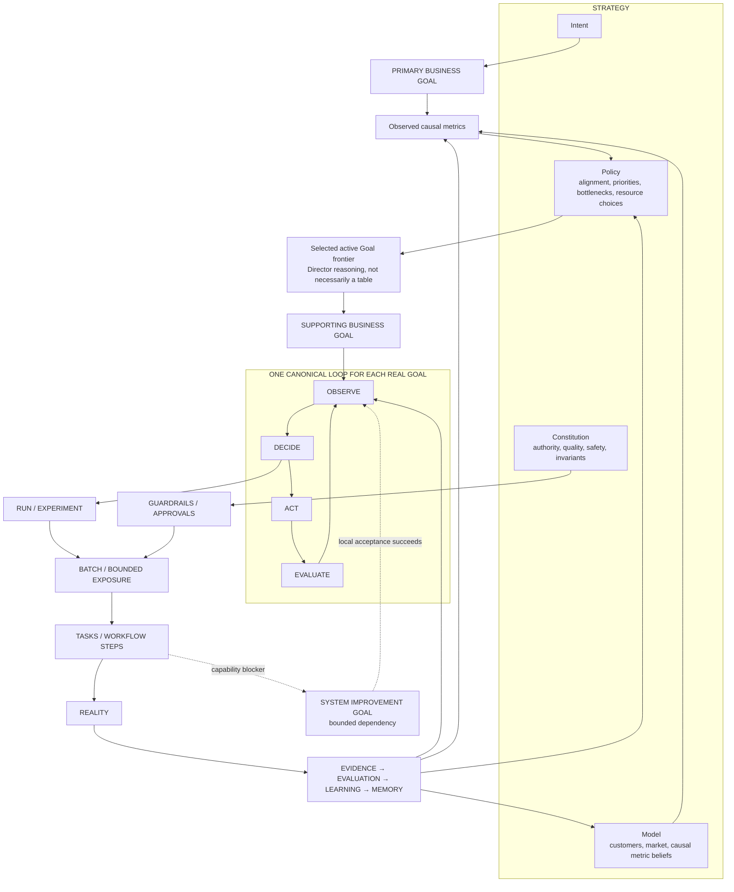
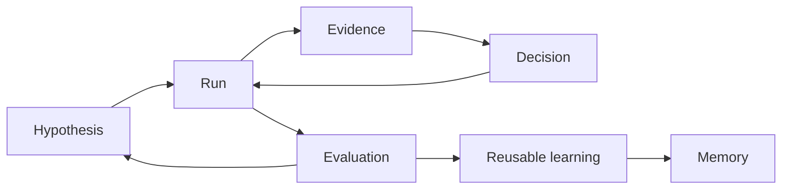
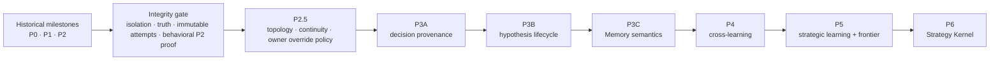

# SpielOS Strategic Cognition Architecture & Execution Plan

**Status:** Implementation complete through P6; controlled end-to-end suite green

**Revision date:** 2026-08-14

**Evidence cutoff:** 2026-08-13 21:22 UTC

**Position updated:** 2026-08-14

**Authority:** Repository code + `.spielos/state/company.sqlite` override historical phase labels when they disagree

**Scope:** Preserve one company runtime, make pursuit semantics and evidence trustworthy, close the learning chain, then add strategic cognition without speculative infrastructure.

---

# Current position

This section is the living operator memory. Update it after every completed step.

**Now:** Roadmap implementation complete through P6; ready for controlled
operational testing against real Goals and separately approved external actions.

**Just completed:** P6 Strategy Kernel. ICP, positioning, voice, and measurement
are named views of one validated reference-only state organized as Intent,
Model, Policy, and Constitution. Goals receive their measurable Intent and at
most eight explicitly relevant strategy sections; Memory stays separate,
references fail closed, and approved strategic experiments cannot mutate
canonical strategy.

**Next step:** Exercise the system operationally with controlled Goals. Each
live send, publish, spend, code change, or strategy edit still requires its own
normal runtime authority and approval.

**Parked / do not start:** Autonomous strategy revision, strategy database,
graph infrastructure, or any inference that technical acceptance proves a
business result. These remain explicit non-goals, not unfinished roadmap work.

## Why this order

Historical P0/P1/P2 are labeled achieved. They are not safe enough to build on:

- `company status` constructed a write `Runtime`, and `Runtime.__init__` marked every handler **deployed**.
- Tests that omitted `--db` or installed Departments could touch the live database and live company tree.
- A business Goal can still be marked achieved from technical or unrelated child evidence.
- A failed repair can later be rewritten as completed on the same task/Run. **Closed in 6.3.**
- P2 proved package shape, not shared-interpreter behavior. **Closed in 6.4; the suite is green.**
- The email campaign sits `completed` while still unmet because continuation requires `company next`.
- Batch 2 is modeled as its own Goal.
- P3A is authorized and blocked; executing it now would attach provenance to contradictory or invalid evidence.

## Ordered remaining work

| # | Step | Product-visible change | Lean check | Status |
|---|---|---|---|---|
| 0 | Preserve dirty worktree | Content/campaign/audio edits stay off the integrity path | Baseline recorded; 6.1 files do not absorb those edits | Recorded |
| 1 | Integrity 6.1 isolation | `status` / `catalog` / the suite no longer rewrite deployed versions, timestamps, or Department files | Hash live versions, approvals, and Department files; run `status`, `catalog`, and isolation tests; those hashes identical | **Done** 2026-08-13 |
| 2 | Integrity 6.2 business truth | A business Goal cannot be achieved by a repair, an unrelated child, or invalid evidence | Four adversarial fixtures: technical children, unrelated business children, invalid evidence, valid technical Goal | **Done** 2026-08-13 |
| 3 | Integrity 6.3 append-only repairs | A failed coding task stays failed; the next try is a new task or Run | Fail then succeed → two attempts, one coherent terminal evaluation | **Done** 2026-08-13 |
| 4 | Integrity 6.4 behavioral P2 | Content, Analytics, and Outbound run through one interpreter; suite green on this tree | One real flow each; every override named; current suite green | **Done** 2026-08-13 |
| 5 | P2.5A alignment + override | Low-value work is deferred unless the owner overrides; the record says override | Unrelated repair → defer → override → audit still says override | **Done** 2026-08-13 |
| 6 | P2.5B automatic next Run | Unmet campaign with a valid next experiment continues without `company next`; send still needs approval | `goal-email-campaign-20260810` continues; guarded send still asks | **Done** 2026-08-13 |
| 7 | P2.5C iterative System Improvement | One approved repair Goal can retry inside the same scope | Fail acceptance → fresh task, same Goal and allowed files | **Done** 2026-08-13 |
| 8 | P2.5D parent return | Child success wakes the parent; parent re-measures and is not auto-achieved | Child success wakes parent; parent stays unmet if its metric is unmet | **Done** 2026-08-13 |
| 9 | P2.5E one causal frontier | Reply rate stays primary; a batch is exposure, not a peer Goal | One live pursuit shows Primary → Supporting → Runs → Batches | **Done** 2026-08-13 |
| 10 | Revalidate then P3A | A decision answers “why?” with the exact evidence IDs used | One Department decision and one Director decision have real `evidence_ids` | **Done** 2026-08-13 |
| 11 | P3B hypothesis lifecycle | Hypotheses resolve to supported / rejected / inconclusive | One business experiment closes; an adjacent repair does not | **Done** 2026-08-13 |
| 12 | P3C Memory semantics | Memory stores reusable claims, not completion diaries | A later decision retrieves one valid claim and uses it | **Done** 2026-08-13 |
| 13 | P4 cross-learning | Outbound learning can change a later Content decision | One fact retrieved across Departments, no context dump | **Done** 2026-08-13 |
| 14 | P5 strategic frontier | Persistent valid business failure becomes a Policy/Model experiment | One repeated valid failure escalates instead of another repair | **Done** 2026-08-14 |
| 15 | P6 Strategy Kernel | ICP, positioning, voice, and measurement become views of one state | No second strategy authority; no autonomous strategy mutation | **Done** 2026-08-14 |

## 6.4 verification (2026-08-13)

```text
requires is AND, not OR
Content quality_gate waits for render_report via an explicit render_handoff
Analytics funnel-analysis requests funnel_report through the interpreter
Outbound social-lead-research uses the interpreter
email-outreach is the only named stage exception
campaign_contract 1.1 is current; 1.0 remains compatible; legacy batch_items rejected
Batch 2/3 validate at their actual phase, not a forced strategy phase
package validation rejects a required kind with no producer or declared handoff
+ full company suite: 241 collected, 0 failures
```

The integrity gate is closed. P2.5 may begin. Do not execute the parked P3A task until P2.5 is complete and that task is revalidated.

## P2.5A verification (2026-08-13)

```text
pursuit kinds and invariants locked in runtime/alignment.py + tests
unrelated SI → proposed + defer_recommended + opportunity cost
owner approve/resume → work may proceed; judgment stays defer_recommended
override does not grant execute approval
child of a market outcome is aligned (enables) and starts
Director rollup is not a market outcome
declared outcome_id must be an active market Goal
lineage fields stay unknown unless supplied; files/test counts do not fill them
Director recommends defer when lineage is complete but alignment is not
+ 15 new alignment tests pass
+ full company suite: 256 collected, 0 failures
```

P2.5B may begin. Do not treat 2.5A as permission to auto-continue campaigns (that is P2.5B) or to execute P3A.

## P2.5B verification (2026-08-13)

```text
active + unmet + valid next experiment → next Run without company next
guarded send on the new Run still awaits execute approval
invalid/contaminated evaluation does not continue
empty next_experiment does not continue
system_improvement next_experiment is a blocker, not a continuation
paused ancestor blocks child continuation
same email/outbound channel already awaiting approval blocks automatic next
manual company next still works as the escape hatch
SI Goals are not auto-iterated (that is P2.5C)
Director/outbound/status copy no longer asks permission to continue pursuit
+ 10 new continuation tests pass
+ full company suite: 266 collected, 0 failures
```

P2.5C may begin. Do not treat 2.5B as permission to auto-retry failed repairs (that is P2.5C) or to execute P3A.

## P2.5C verification (2026-08-13)

```text
fail acceptance → fresh task, same Goal, same allowed files
same-scope retry does not ask for execute approval again
widened allowed_files/problem parks for a new approval
max_attempts stops automatic iteration
failed task stays failed; success is a new task/Run
SI evaluation stays technical_only and does not satisfy a parent business metric
+ 3 new iterative repair tests pass
+ full company suite: 269 collected, 0 failures
```

P2.5D may begin. Do not treat 2.5C as permission to auto-achieve a parent from a child repair, or to execute P3A.

## P2.5D verification (2026-08-13)

```text
supporting success returns a waiting parent to OBSERVE/idle
parent re-measures its own reply-rate outcome and stays unmet
successful System Improvement consumes resume_run_id and starts the originating pursuit's next valid Run
failed and paused children surface durable parent attention without satisfying the parent
duplicate terminal child transitions do not create duplicate parent Runs
pausing or terminating an ancestor pauses active descendants and cancels open or claimed Work Orders
notification upsert preserves action_required when a child fails synchronously inside Director dispatch
P2.5B regression now asserts descendant pause instead of assuming a paused child remains runnable
+ 7 parent-return tests and 21 focused parent/continuation/terminal tests pass
+ full company suite: 276 collected, 0 failures
```

P2.5E may begin. Do not treat 2.5D as permission to execute P3A or to model a batch as a peer Goal.

## P2.5E verification (2026-08-13)

```text
explicit config.pursuit_kind=batch is rejected before Goal persistence
only primary_goal, supporting_goal, and system_improvement_goal are Goal roles
Batch exposure is projected from existing run.config_snapshot.batch metadata
reply-rate Primary Goal selects one delivery-rate Supporting Goal
Batch 01 and Batch 02 remain inside Run 1 and Run 2; neither becomes a Goal
bounded System Improvement resumes the originating Supporting Goal at Run 2
successful child and repair evidence do not satisfy the parent reply-rate metric
completed unmet pursuit continues without a permission prompt; guarded repair still required approval
no graph table, scheduler, portfolio optimizer, or public vocabulary layer added
+ 2 causal-frontier tests pass
+ 32 focused alignment/continuation/parent-return tests pass
+ full company suite: 278 collected, 0 failures
```

P2.5 is complete. Revalidate P3A from runtime `5.3.2`; do not execute its stale `5.3.1` task.

## P3A verification (2026-08-13)

```text
stale approved task change-5c1ca3c4a2 (5.3.1 → 5.4.0) abandoned without rewrite
fresh task change-46fcae9e00 revalidated from runtime 5.3.2
shared interpreter decisions link only metric, prerequisite, or package evidence inspected by the chosen branch
Director system-intervention decisions link only invalid/contaminated evidence from the child's latest evaluated Run
runtime accepts requested provenance only from the current Run, evaluated children, or ancestor lineage
unrelated visible evidence is excluded; obsolete child attempts are not selected
no decision, evidence, Goal, or graph schema added
+ 2 exact provenance fixtures pass
+ runtime + interpreter suites: 60 collected, 0 failures
+ full company suite: 280 collected, 0 failures
```

P3B may begin. Do not treat decision provenance as hypothesis resolution or reusable Memory.

## P3B verification (2026-08-13)

```text
Run hypotheses resolve append-only: active → supported | rejected | inconclusive
evaluation explicitly names the exact hypothesis attached to its Run and records prediction_tested=true
the prediction-test assertion remains in the persisted evaluation metrics for audit
goal achievement without a prediction test leaves the hypothesis active
a mismatched hypothesis/Run branch cannot resolve it
invalid or contaminated prediction tests close only as inconclusive
technical-only acceptance may resolve a technical Run hypothesis but not a business hypothesis
an adjacent System Improvement resolves only its own hypothesis and leaves the business hypothesis active
no table, column, graph store, or second loop added
+ 7 hypothesis lifecycle fixtures pass
+ business-truth + runtime + lifecycle suites: 70 collected, 0 failures
+ full company suite: 287 collected, 0 failures
```

P3C may begin. Do not treat routine completion events or every evaluation as reusable Memory.

## P3C verification (2026-08-13)

```text
Memory requires reusable=true, explicit decision relevance, bounded applicability, and exact Evidence IDs
all supporting Evidence IDs must belong to the current Run and be valid for that Goal
routine completion and shortfall summaries stay out of Memory
invalid support and malformed learning payloads are ignored without destabilizing the Run
retrieval is same-Department and bounded to the current Goal plus ancestor Goals
unrelated same-owner Goals do not receive the claim
a later related decision persists the selected Memory ID and includes its claim in the rationale
no table, column, embedding index, vector database, or cross-Department retrieval added
+ 6 Memory semantics fixtures pass
+ interpreter + runtime + Memory suites: 66 collected, 0 failures
+ full company suite: 293 collected, 0 failures
```

P4 may begin. Do not widen retrieval until relevance, boundedness, and actual decision use remain explicit across Departments.

## P4 verification (2026-08-13)

```text
company sharing requires share_scope=company, explicit audience Departments, and explicit topics
the receiving Goal must opt into matching config.memory_topics
same-Department current/ancestor retrieval remains intact
a validated Outbound positioning/customer claim reaches a later related Content decision automatically
the persisted Content decision records the Memory ID and includes the claim in its rationale
wrong-topic, wrong-audience, unshared, and invalid claims never enter Content context
cross-Department context is capped at ten newest matching claims
no table, column, embedding index, vector database, or implicit company context added
+ 5 cross-Department learning fixtures pass
+ Memory + interpreter + cross-learning suites: 18 collected, 0 failures
+ full company suite: 298 collected, 0 failures
```

P5 may begin. Do not treat one failed Run, technical failure, or invalid evidence as permission to change Policy or Model.

## P5 verification (2026-08-14)

```text
strategic escalation requires three consecutive valid business experiments on one Supporting Goal
each Run must reject its own exact tested hypothesis
each Run must report competent execution and a trustworthy system
the proposal names its Policy/Model level, scope, discriminating experiment, confidence, and contradiction assessment
the persisted Director decision cites the exact three business Evidence, Run, and hypothesis IDs
one failure, technical-only or invalid evidence, unresolved hypotheses, and untrusted execution never escalate
the proposal parks for owner approval; approval authorizes a test and never mutates strategy
+ 5 strategic-frontier fixtures pass
+ runtime + business-truth + strategic-frontier suites: 68 collected, 0 failures
+ full company suite: 303 collected, 0 failures
```

P6 may begin. Do not treat an approved strategic experiment as permission to
rewrite ICP, positioning, voice, measurement doctrine, or any canonical
strategy file automatically.

## P6 verification (2026-08-14)

```text
kernel.json references canonical source sections; it does not duplicate their claims
the logical state validates Intent, Model, Policy, and Constitution in order
ICP, positioning, voice, and measurement are named views of that state
each source section carries a current SHA-256 and escaping or malformed references fail closed
each Goal receives its measurable current Intent plus at most eight explicitly relevant sections
Memory remains a separate context tier and Evidence is never copied into strategy
company strategy and catalog expose the same read-only state hash without constructing Runtime
approving a strategic experiment leaves every canonical strategy-source hash unchanged
+ 6 Strategy Kernel fixtures pass
+ runtime + isolation + strategic-frontier + Kernel suites: 73 collected, 0 failures
+ full controlled company suite: 309 collected, 0 failures
```

The implementation roadmap is complete through P6. Operational results remain
to be learned from real, separately authorized business Runs; technical suite
success is not a market conclusion.

## 6.3 verification (2026-08-13)

```text
proposed → approved → completed|failed is guarded
failed or completed task cannot be completed again
retry after a failed SI evaluation opens a new Run
fail then succeed → two tasks, two Runs, reject stays on the failed Run
success without deploy is tested, not deployed
+ 5 new append-only repair tests pass
+ 27 SI/isolation/truth tests pass
+ full suite: 233 collected, 1 pre-existing Batch 2 contract failure (6.4 work)
```

P2.5 may begin. Do not treat 6.3 as permission to auto-iterate repairs without approval (that is P2.5C) or to execute P3A.

## 6.2 verification (2026-08-13)

```text
technical children + 0 business evidence → parent unmet
unrelated business children + 0 target metric → parent unmet
invalid evidence of the right kind → Goal unmet
technical Goal + valid technical acceptance → technical Goal achieved
deadline cannot overwrite an achieved Goal
config cannot convert a business parent to technical_only
historical goal-content-leads-20260812 is pre-invariant, not current truth
+ 10 new business-truth tests pass
+ 101 core runtime/truth/interpreter/isolation tests pass
+ full suite: 228 collected, 1 pre-existing Batch 2 contract failure (6.4 work)
```

6.3–6.4 must still pass before P2.5. Do not treat 6.2 as permission to auto-continue the email campaign or execute P3A.

## 6.1 verification (2026-08-13)

```text
owner_versions unchanged by status + catalog + test suite
+ Department files and installed-agent files unchanged
+ approvals unchanged
+ 28 isolation/install/fixture tests pass
+ 76 core runtime/snapshot/contract tests pass
+ full suite: 218 collected, 1 pre-existing Batch 2 contract failure (6.4 work)
```

Live runner independently advanced one Goal timestamp and added one evidence row during verification. That is not a 6.1 mutation. 6.2–6.4 must still pass before P2.5. Do not treat 6.1 alone as permission to continue the email campaign automatically or to execute P3A.

## Dirty worktree baseline (2026-08-13)

These edits are a separate Content/campaign/voice stream. Do not mix them into integrity repairs:

- `.agents/company/departments/campaign_contract.py`
- `.agents/company/departments/content/`
- `.agents/company/departments/design/department.py`
- `.agents/company/runtime/catalog.py`
- `.agents/company/runtime/director.py`
- `.agents/company/strategy/voice.md`
- `.agents/skills/copywriting-en/SKILL.md`
- campaign/handoff/content tests already dirty in the tree
- `public/videos/audio/*`, `public/live-state.json`, `src/data/live-goals.json`

6.1 may touch only isolation files: runtime loop/store, CLI, install isolation, isolation tests, and synthetic fixture redaction.

6.2 added `.agents/company/runtime/truth.py` and changed Director evaluate, interpreter evaluate, and Runtime persist/deadline/evidence-wake. `director.py` was already dirty; this revision owns the evaluate contract.

6.3 changed `Store.complete_change_task` transitions, `Runtime.complete_change`, and `Runtime.retry` so a failed SI evaluation starts a new Run instead of rewriting the failed task.

---

# 0. Executive decision

The architecture to protect remains:

> **One execution loop + one capability system + one learning substrate + one strategic theory of the company.**

The updated discussion does not replace that architecture. It exposes a missing middle layer:

```text
Strategy
↓
Causal model of the business
↓
Primary business Goal
↓
Selected supporting Goal frontier
↓
The same Goal loop for every autonomous outcome
↓
Runs
↓
Batches
↓
Tasks / Workflows
↓
Reality
↓
Evidence / learning
↑
```

The code and database support the need for this refinement. They also show that the runtime is **not ready to implement P2.5 or P3A safely yet**.

The truthful sequence is now:

```text
Historical P0/P1/P2 milestones
→ mandatory pre-P2.5 integrity gate
→ P2.5 pursuit topology and continuity
→ revalidate and resume P3A
→ P3B hypothesis lifecycle
→ P3C Memory semantics
→ P4 cross-run / cross-Goal / cross-Department learning
→ P5 strategic learning + active Goal frontier
→ P6 Strategy Kernel
```

Why the integrity gate was inserted:

- P0's persisted milestone fixed one technical-vs-business case, but did not make business truth generally sound.
- P1 only guards Director-created system improvements, not all material decisions or Goal intake.
- P2 proved package shape, not full shared-runtime behavioral conformance; the current worktree is also not green.
- diagnostic CLI reads and parts of the test suite can mutate the live company database.
- failed repair tasks and contaminated Runs can later be rewritten as successful without preserving clean terminal history.

P3A is already approved, but has no implementation result. It must remain parked until the integrity gate and P2.5 are complete, then its allowed files, version target, and acceptance tests must be revalidated.

---

# 1. Evidence boundary and audit method

This plan distinguishes:

1. **Confirmed runtime evidence** — directly observed in code, tests, or SQLite.
2. **Architectural inference** — the smallest explanation consistent with several confirmed facts.
3. **Proposed change** — work that must still earn implementation through a bounded Goal and acceptance evidence.

Audit sources:

- `.agents/company/runtime/`
- representative Department packages and their tests
- `.agents/company/README.md`
- the live `.spielos/state/company.sqlite`
- the updated architecture discussion supplied by the founder
- the current dirty worktree, not merely the last committed snapshot

Important audit disclosure:

> `company status` and other apparently read-only CLI commands construct `Runtime`, and `Runtime.__init__` registers current handler versions as deployed. Some CLI tests also default to the live database. During this audit, diagnostic commands updated deployment timestamps in the live database. No business action, Goal, approval, source implementation, or P3A task was intentionally executed.

All final database counts below were therefore taken through an immutable read-only SQLite connection. The live runner remained active, so time-sensitive evidence counts are explicitly timestamped.

---

# 2. Architectural north star

SpielOS has three orthogonal questions:

1. **Operating loop:** What happens next?
2. **Pursuit topology:** Where does this work belong in the outcome structure?
3. **Reasoning altitude:** At what explanatory level should something change?



No second lifecycle, graph database, strategy daemon, or portfolio subsystem is implied.

---

# 3. Canonical semantic contract

| Concept | Canonical meaning | Explicitly not |
|---|---|---|
| **Primary Goal** | Durable measurable business outcome selected from Intent | A slogan, task list, batch, or technical readiness proxy |
| **Supporting Goal** | Measurable business driver promoted to autonomous pursuit because it is an active bottleneck | Every metric in the causal model |
| **System Improvement Goal** | Bounded technical or capability outcome that enables or restores trustworthy pursuit | Proof that the parent business outcome happened |
| **Run** | One controlled attempt or experiment toward a Goal | The Goal itself |
| **Batch** | Bounded volume/time exposure inside one Run | A new Goal or new hypothesis by default |
| **Task** | Known bounded work inside execution | An autonomous pursuit unless uncertainty genuinely requires one |
| **Guardrail** | Quality, risk, evidence, or authority constraint | A Goal by default |
| **Metric graph** | Causal beliefs about variables that drive an outcome; part of Model | A persisted Goal hierarchy |
| **Goal graph** | The small set of outcomes currently deserving autonomous pursuit | Every observable metric |
| **Active frontier** | Policy/Director judgment about the smallest worthwhile Goal set | A required database object in V1 |

`Run`, `Batch`, and `Task` are explanatory operating terms here, not three new public company building blocks. A Run remains the existing typed runtime record. A Batch should initially be a run-linked Artifact/manifest. Known work remains a Workflow Step or Work Order. Do not add universal Batch or Task tables until repeated cross-Department evidence proves a shared lifecycle is needed.

Hard invariants:

```text
Metric ≠ Goal by default.
Run ≠ Goal.
Batch ≠ Goal.
Task ≠ Goal.
Guardrail ≠ Goal.
Dependency success ≠ parent success.
Run completion ≠ Goal completion.
Technical evidence ≠ business evidence.
Owner override ≠ strategic justification.
```

## 3.1 Pursuit topology and reasoning altitude are independent

Pursuit topology asks:

```text
Primary Goal | Supporting Goal | Run | Batch | Task | Dependency
```

Reasoning altitude asks:

```text
execution | system | policy | world model
```

The same supporting Goal can fail because execution volume is low, a system is unreliable, channel allocation policy is wrong, or the underlying channel belief is false. The Director must preserve both coordinates.

## 3.2 Refined strategic lineage

Every material intervention should preserve:

```text
root business Goal
→ current active Goal
→ observed gap
→ pursuit location
→ reasoning altitude
→ causal diagnosis
→ smallest intervention
→ expected measurable effect
→ exact result evidence
→ return of authority
```

---

# 4. Audited current state

## 4.1 Live durable state

SQLite integrity check: `ok`. Foreign-key check: no violations.

Snapshot at the evidence cutoff:

| Runtime object | Count / state |
|---|---:|
| Goals | **79** |
| Goal states | 55 achieved · 12 active · 10 abandoned · 1 expired · 1 paused |
| Runs | **80** |
| Run types | 66 system improvement · 6 execution · 4 business experiment · 3 system test · 1 evaluation |
| Run states | 67 completed · 8 blocked · 2 waiting · 2 awaiting approval · 1 idle |
| Evidence | **1,163**: 1,003 business · 154 technical-only · 6 invalid |
| Decisions | **138**; **0** contain evidence IDs |
| Evaluations | **63** |
| Hypotheses | **28**; all **28 active** |
| Memory claims | **5** |
| Change tasks | **64**: 49 completed · 7 approved · 5 proposed · 3 failed |
| Work orders | **10**: 7 done · 2 open · 1 cancelled |

System improvement dominates the operating history:

```text
65 of 79 Goals are owned by system-improvement.
66 of 80 Runs are system-improvement Runs.
54 system-improvement Goals are root Goals; only 11 are children.
```

This does not prove every repair was low-value. It proves that the runtime currently lacks strong hierarchical and prioritization pressure against machinery-first work.

## 4.2 Concrete live topology evidence

- `goal-email-campaign-20260810` was the pre-2.5B fixture: active, Run completed and unmet, valid next experiment, runner would not continue it. After 2.5B the runner continues that shape automatically; the next send still asks.
- `goal-content-batch02-package-v1-20260813` models Batch 2 as its own Goal. This is direct evidence of Goal/Batch semantic compression.
- `goal-strategic-cognition-p3a-provenance-20260813` is active and approved, but blocked at `ACT.execute_change`; task `change-5c1ca3c4a2` has no result.
- `goal-content-leads-20260812` remains historically achieved from two technical system-improvement children without observed lead evidence. P0 did not repair historical false state.
- three achieved repair Runs contain both failed and passed change-validation evidence, both reject and keep evaluations, and a stale failure contamination reason.

## 4.3 Phase truth table

| Phase | Durable runtime label | Audited semantic status | Decision |
|---|---|---|---|
| **P0 Business truth** | achieved | **Partial; gate reopened** | Historical fixture passed, but the general invariant is not proven |
| **P1 Strategic discipline** | achieved | **Partial** | Director system-improvement lineage exists; Goal alignment and general material-decision coverage do not |
| **P2 Lego boundary** | achieved | **Behavioral freeze proved in 6.4** | Interpreter flows, AND-requires, named email exception, suite green |
| **Pre-P2.5 integrity gate** | implemented 6.1–6.4 | **Closed 2026-08-13** | Isolation, business truth, append-only attempts, and Lego behavior proved |
| **P2.5 Topology + continuity** | 2.5A–C implemented | **A–C done; D–E not started** | Alignment, auto-continue, and same-scope SI retry live |
| **P3A Decision provenance** | active + approved + blocked | **Authorized, unimplemented, parked** | Revalidate after P2.5; do not execute current task yet |
| **P3B Hypothesis lifecycle** | absent | **Not started** | All 28 hypotheses remain active |
| **P3C Memory semantics** | absent | **Not started** | Five claims; mostly execution summaries |
| **P4** | absent | **Not started** | Current retrieval is owner/current-Goal local |
| **P5** | absent | **Not started** | No causal bottleneck or active-frontier reasoning |
| **P6** | absent | **Not started** | Existing strategy documents remain authoritative |

Historical “achieved” records remain valid records of what was accepted at that time. They are not allowed to overrule new counter-evidence.

## 4.4 Current test health

- The persisted P0/P1/P2 acceptance evidence records an earlier all-green 209-test snapshot.
- A fresh run of the same 209 tests against the current dirty worktree produced **one genuine failure** after environment-only installation errors were removed.
- The remaining failure is contract/fixture drift: a rendered Batch 2 artifact is explicitly validated as if it were still in the strategy phase.
- Therefore the previous P2 evidence was true for its completion snapshot, not for the current worktree.

The worktree contains overlapping uncommitted runtime, Department, test, strategy, asset, and live-snapshot changes. P3A's allowed files overlap that dirty state.

---

# 5. Confirmed defects, risks, and consequences

## 5.1 Critical: supposedly read-only commands mutate live state

Confirmed path:

```text
CLI main
→ Runtime(...)
→ register every installed handler version as deployed
→ owner_versions updated
```

Some tests that omit an explicit database path therefore touch the live database. Test install cases can also create and delete Department files beneath the live company tree.

Consequences:

- audit evidence changes while being observed;
- “deployed” no longer proves deployment;
- test summaries and deployment timestamps can be overwritten;
- a failing test run can contaminate company history;
- phase evidence cannot be trusted without isolating the database first.

## 5.2 Critical: P0 does not yet guarantee business truth

Current Director logic filters achieved children by accepted run validity for `all_children_achieved`. That closes one narrow defect, but:

- unrelated **business-valid** children can still satisfy an unrelated parent business outcome;
- a parent can opt into `accepted_evidence_validity = [technical_only]`;
- `achieved_children` still counts raw technical children;
- the shared interpreter counts evidence kinds without checking evidence validity;
- `business_learning_allowed` can label an evaluation business-valid even when the counted evidence was invalid.
- handlers can set an achieved Goal status without a central runtime proof check;
- `Runtime.once()` checks deadline expiry before it checks whether the Goal is already terminal, so an achieved Goal called after its deadline can be overwritten as expired.

Consequences:

- invalid or merely adjacent evidence can achieve a Goal;
- false evaluations can enter later hypothesis and Memory logic;
- P3 would make bad conclusions more durable and more influential.

## 5.3 Critical: repair history is mutable and contradictory

`complete_change` accepts a task regardless of its current status. A failed task can be completed later, producing a second validation and evaluation on the same Run.

`update_run(... contamination_reason=None)` means “preserve the old value,” so success cannot clear stale failure contamination.

Confirmed live result:

```text
same Run
├── invalid failed change_validation
├── technical-only passed change_validation
├── reject evaluation
├── keep evaluation
└── completed Run still carrying failure contamination
```

Consequences:

- terminal results are not terminal;
- provenance becomes ambiguous;
- future P3A may link to the wrong evidence;
- “latest evaluation wins” hides contradictory history instead of modeling a new attempt.

## 5.4 High: P1 lineage is present but not reliably grounded

Director-created system improvements now receive a complete-looking lineage record, but missing fields are synthesized from the problem string, allowed-file count, and acceptance-test count. Validation then checks that those generated strings are non-empty. The current regression fixture passes without supplying real observed reality, causal diagnosis, effect, or stop-condition evidence.

Direct/root System Improvement Goals bypass this P1 path entirely.

Consequences:

- a plausible generated narrative can be mistaken for evidence-backed reasoning;
- most root repairs do not prove alignment to an active business outcome;
- P1 currently reduces missing fields, but does not yet guarantee causal truth or priority.

The repair is not a new lineage service. Require actual caller/Director evidence for material claims, retain explicit unknowns instead of inventing certainty, and apply the P2.5 alignment/owner-override policy to direct requests.

## 5.5 High: P2 freeze proves shape, not behavior

`validate_package` validates declared IDs and references. The freeze tests confirm catalog fields and package defects. They do not prove that representative Departments actually use the common interpreter for their lifecycle.

Outbound overrides all four stage methods for social workflows as well as the documented email exception, while still appearing as `lego: true`.

The shared interpreter also treats a step with multiple `requires` kinds as ready when **any one** required kind exists. Content's quality gate declares both `campaign_manifest` and `render_report`, but can be selected with only the manifest, and its graph does not itself declare a producer for `render_report`.

Consequences:

- the runtime can declare a boundary frozen without proving it;
- bespoke lifecycle behavior may multiply behind catalog-compatible metadata;
- P2.5 changes could accidentally support two behavioral architectures.

This is not proof that the Outbound code should be deleted. Its deprecated `EmailWorkflow` remains required for persisted goals and is reused by the current Outbound Department. It is compatibility debt, not confirmed dead code.

The current campaign contract has also added required brief, link-placement, copy, and fifth-item semantics while retaining schema version `1.0`. A second legacy Content contract and tests still assert retired note/live-journey behavior. That is active contract duplication and an undetectable compatibility break, not lean evolution.

## 5.6 High: continuation is deliberately absent

The runner excludes completed Runs. `Runtime.next()` exists, but only an explicit caller invokes it. A regression test currently enforces that manual pause.

Consequence:

> An active, unmet Goal with a valid next experiment stops thinking until a human restarts it.

Approvals are not the problem. The runtime currently conflates permission to continue pursuit with permission to perform a guarded external action.

The runner's only scheduling policy is depth followed by creation time. There is no priority, fairness, capacity, budget, or cross-Goal resource-conflict check. Automatic continuation without a minimal bounded arbitration policy could let iterative Goals starve business work and deepen the current system-improvement bias.

## 5.7 High: pursuit topology is compressed into `parent_id`

There is no Primary/Supporting/Dependency semantic distinction. Batches and repairs are frequently represented as root Goals. The database has 54 root system-improvement Goals.

Consequences:

- the Director cannot reliably choose a small active frontier;
- a batch can compete with a business outcome as if both were strategic peers;
- root repairs lose causal return paths;
- reporting exaggerates the number of autonomous pursuits.

## 5.8 High: System Improvement is bounded but not iteratively autonomous

The current handler creates one change task, waits for a coding executor, and evaluates that task. It does not create a fresh bounded task after failed acceptance while retaining the same local Goal and scope.

Consequences:

- related repair iterations become separate Goals or an unsafe rewrite of the same task;
- the business parent is repeatedly interrupted;
- approval and version histories become hard to interpret.

## 5.9 Medium: parent return exists only partially

When a child state changes, the runtime calls `wake_goal(parent)`. `wake_goal` only affects a parent currently in `waiting`, and only moves `resume_at`; no test proves complete supporting/dependency return semantics.

The good foundation is already present. P2.5 should complete and test it, not replace it.

Additional containment gaps:

- persisted `resume_run_id` is not consumed to restore the originating business Run;
- a parent pause/terminal transition does not cascade to descendants;
- terminal cleanup cancels open Work Orders but not already claimed Work Orders;
- the global automation stop is enforced by the background runner, but foreground `once`, `next`, `retry`, and approval paths do not all consult it.

## 5.10 Medium: learning objects exist but do not close

- decisions have an evidence-ID field, but all 138 are empty;
- all 28 hypotheses are permanently active;
- four of five Memory claims are routine execution summaries;
- Memory retrieval is owner-local and current-Goal/local-owner global.

Consequence: the database records activity well, but it does not yet create dependable reusable company knowledge.

## 5.11 Medium: version and source truth are ambiguous

- runtime catalog declares `5.3.1`, while its owner-version row is only tested;
- Runtime construction can promote current handler code to deployed without a deployment event;
- several historical versions remain marked deployed;
- Design source currently declares `3.2.1`, while `3.3.0` also remains recorded as deployed and another proposed repair points from `3.3.0` back to `3.2.1`.

Consequence: version labels cannot currently answer which code was tested, deployed, or merely imported.

## 5.12 Code concentration and duplication

Large concentrated files include `store.py`, `loop.py`, the Outbound provider stack, and multi-thousand-line test modules. Size alone is not a defect, and this audit found no basis for a broad refactor.

Confirmed lean-code concerns are narrower:

- one duplicate Goal name exists across an abandoned and achieved system-improvement Goal;
- compatibility email behavior is split across a large handler and a separate workflow bundle;
- catalog conformance duplicates confidence that behavioral tests do not provide;
- old false terminal records remain alongside corrected runtime logic.

One test module claims to use synthetic Outbound data while embedding live operational/customer ledger details, including personal contact and reply data. This is a privacy, staleness, and repository-retention defect; fixtures must be redacted or regenerated from synthetic records.

Do not perform cleanup for aesthetics. Refactor only where an acceptance defect or recurring change cost proves the need.

---

# 6. Mandatory pre-P2.5 integrity gate

This is a readiness gate, not a new public architecture layer. Each runtime code change must be a separate bounded system-improvement Goal with its own allowed files and acceptance evidence.

## 6.1 Isolate observation, tests, and deployment registration

Required behavior:

- read commands open the database read-only and never register deployments;
- handler discovery is side-effect free;
- deployment/version registration occurs only in an explicit write path;
- all tests use temporary databases unless a test explicitly and safely targets a fixture;
- tests cannot install/delete files in the live company tree;
- an automated guard fails if a test opens the canonical live database for writing.
- operational/customer fixtures are synthetic or irreversibly redacted before repository retention.

Stop condition:

> Running status, catalog, and the full suite leaves hashes or audit projections of live Goals, Runs, evidence, versions, approvals, and Department files unchanged.

## 6.2 Complete the P0 truth invariant

Required behavior:

- accepted evidence must both be valid and measure the Goal's declared outcome;
- a parent business outcome cannot be achieved from unrelated child completion;
- user config cannot silently convert a business Goal into a technical readiness Goal;
- the shared interpreter ignores invalid/contaminated evidence for Goal satisfaction;
- business evaluation validity derives from accepted evidence and declared outcome semantics, not a boolean config alone;
- technical readiness remains able to achieve an explicitly technical Goal.
- terminal Goal states cannot be overwritten by later deadline checks;
- the central runtime rejects an achieved transition that lacks the handler's declared, validity-compatible metric proof.

Do not add a large Goal taxonomy merely to fix this. First prove the minimum semantic discriminator with adversarial fixtures.

Required fixtures:

```text
technical children achieved + 0 business outcome evidence → parent unmet
unrelated business-valid children achieved + 0 target evidence → parent unmet
invalid evidence of the correct kind → Goal unmet
technical Goal + valid technical acceptance evidence → technical Goal achieved
```

Historical false states must be handled explicitly: migrate, mark superseded/invalid, or document them as pre-invariant history. Do not silently leave them as current business truth.

## 6.3 Make repair attempts append-only and coherent

Required behavior:

- proposed → approved → completed/failed transitions are guarded;
- a completed or failed task cannot be completed again;
- another repair attempt creates another task or Run;
- contamination can be explicitly cleared only by a new valid attempt, not by mutating the failed attempt;
- a Run has one coherent terminal evaluation, or the model explicitly distinguishes evaluation attempts;
- deployment status is separate from tested status.

Stop condition:

> A failed acceptance followed by a successful repair produces two traceable attempts, never one contradictory Run.

## 6.4 Re-prove the P2 boundary behaviorally

Required proof:

- one Content flow, one Analytics flow, and one Outbound flow execute through the shared interpreter contract;
- every bespoke override is named, justified, and tested as an exception;
- `lego: true` means more than serializable metadata;
- every declared `requires` kind is satisfied before a step advances;
- every required cross-Department input has an explicit producing/handoff path;
- incompatible Artifact contract changes advance their schema version and retain an explicit migration/compatibility rule;
- legacy and current campaign contracts are reconciled into one authority;
- the current full suite is green against the exact worktree snapshot;
- the Batch 2 contract/phase fixture is reconciled without weakening phase validation.

This is not permission to reopen the Lego design. The likely output is a narrower truthful freeze statement and a small set of conformance tests.

## Integrity-gate stop condition

Do not begin P2.5 until:

```text
read-only really means read-only
+ tests are isolated from live state
+ business truth passes adversarial validity/semantic fixtures
+ repair history is append-only and coherent
+ representative Lego behavior is proven
+ the exact current suite is green
```

---

# 7. P2.5 — pursuit topology and continuity

P2.5 implements only the runtime behavior already demanded by live evidence. It does not persist a generic causal graph.

## 7.1 P2.5A — semantics and Goal-alignment policy

Lock the definitions in section 3 in runtime documentation and tests.

Before committing meaningful company resources to a requested Goal, Run, or improvement, the Director should judge whether it:

1. supports an active company outcome;
2. enables one;
3. protects a required invariant; or
4. is a justified bounded exploration.

If none apply, the Director should recommend deferral and explain the opportunity cost.

The owner may override that recommendation. The runtime must preserve the distinction:

```text
strategically aligned
vs
Director recommended deferral + owner explicitly overrode
```

Initial implementation rule:

- treat this as Director/Policy behavior;
- use existing decision payload, event, notification, and approval-note capabilities where sufficient;
- do not add a schema, service, portfolio optimizer, or resource-allocation subsystem;
- an owner override does not bypass safety, external-action approval, evidence, or Constitution guardrails.
- do not synthesize confident lineage claims from filenames or test counts; preserve `unknown` and block/defer when material causal fields lack evidence.
- direct/root System Improvement requests receive the same alignment judgment even when they did not originate from a Director child evaluation.

Acceptance fixture:

```text
low-value unrelated improvement requested
→ Director recommends defer with active-outcome rationale
→ owner overrides
→ work may proceed
→ audit record still says owner override, not strategic justification
```

## 7.2 P2.5B — automatic next-Run continuation

Correct transition:

```text
Goal active
+ current Run completed
+ Goal unmet
+ evaluation valid
+ next experiment is present and valid
+ no approval/evidence/authority/blocker suspension
→ create next Run automatically
```

Automatic continuation must stop at:

- Goal achievement, pause, abandonment, expiry, or deadline;
- approval or owner-authority boundary;
- external evidence wait;
- invalid/contaminated evaluation;
- missing or invalid next experiment;
- declared run/budget/attempt limit;
- blocker requiring a supporting or system-improvement Goal.

Continuation creation must be atomic and idempotent. Eligibility must also check:

- the global stop state and active ancestor state;
- fresh approval scope for the new Run's guarded actions;
- deterministic bounded priority/fairness among eligible Goals;
- obvious resource conflicts such as overlapping external audience, budget, channel action, or code-file scope.

This is minimal arbitration, not a portfolio optimizer.

Approvals stay intact. P2.5 removes the unnecessary permission prompt for continuing pursuit, not the permission boundary for sending, publishing, spending, deleting, or changing code.

Primary acceptance case: the existing outbound shape—active Goal, completed unmet Run, valid next experiment—continues without `company next`, while the next guarded external action still requests its normal approval.

Because manual continuation is currently part of the Director skill, notification wording, status guidance, and regression tests, those contracts must change atomically with the runtime. Do not leave documentation telling the Director to stop while code continues automatically.

## 7.3 P2.5C — bounded iterative System Improvement

A System Improvement Goal should be able to perform multiple related repair attempts inside one approved scope:

```text
observe defect
→ choose bounded task
→ execute
→ run local acceptance
→ if still unmet, create a fresh task/attempt
→ if met, achieve dependency and wake parent
```

Fixed across the local pursuit unless re-approved:

- parent/root lineage;
- problem boundary;
- allowed files;
- authority class;
- stop condition;
- non-goals.

A scope expansion, new external side effect, or materially different diagnosis requires new approval or a new Goal.

The local evaluation measures technical acceptance only. It never measures or satisfies the parent business metric.

## 7.4 P2.5D — parent/child return semantics

Minimum contract:

```text
supporting/dependency Goal changes material state
→ waiting parent wakes
→ parent returns to OBSERVE
→ parent re-measures its own outcome and causal metrics
→ parent selects the next bottleneck or continues
```

Never:

```text
child achieved → parent automatically achieved
```

Required tests:

- supporting Goal success wakes parent and parent remains unmet when its metric is unmet;
- System Improvement success wakes parent and parent resumes the business Run or creates the next valid Run;
- failed/paused child surfaces attention without falsely satisfying the parent;
- duplicate child transitions do not create duplicate parent Runs.
- `resume_run_id` or its minimal replacement actually restores the intended originating pursuit;
- pausing/terminating an ancestor prevents descendant continuation and safely resolves open or claimed Work Orders.

## 7.5 P2.5E — prove one causal-frontier scenario without graph persistence

Use one real pursuit, such as outbound replies:

```text
Primary outcome: reply rate
Observed metrics: delivery, bounce, open, click, reply, lead quality
Selected current bottleneck: one of those drivers
Only that driver becomes a Supporting Goal if it needs autonomous pursuit
Runs and Batches remain beneath it
```

Do not create a causal-graph table. Record only what the existing Goal/Run/evidence/decision structures genuinely need for the scenario.

## P2.5 stop condition

One real pursuit demonstrates:

```text
Primary Goal
→ selected Supporting Goal
→ multiple Runs when needed
→ bounded Batches as Run exposure, not Goals
→ a bounded System Improvement dependency when required
→ parent wake and re-observation
→ no false parent achievement
→ no unnecessary continuation prompt
→ all authority guardrails preserved
```

---

# 8. P3 — close the existing learning chain

Target:



## 8.1 P3A — exact Evidence → Decision provenance

Current state:

```text
decisions.evidence_ids_json exists
Store.add_decision accepts evidence_ids
138 decisions exist
0 decisions link evidence
approved task change-5c1ca3c4a2 has no result
```

After P2.5, revalidate the parked P3A task rather than executing it blindly. P2.5 may alter the exact Director context, parent return, or decision producers named in its specification.

Required behavior:

- attach only evidence actually used by the decision;
- do not attach every visible observation;
- distinguish evidence from the current Run, supporting/dependency child, and ancestor context;
- never select an obsolete failed validation when a later attempt is the relevant evidence;
- recover root/current Goal and Run from existing relationships before adding columns.

Stop condition:

> One real Department decision and one Director system-intervention decision each answer “why this action?” with the exact supporting evidence IDs.

## 8.2 P3B — topology-aware hypothesis lifecycle

Minimal lifecycle:

```text
active → supported | rejected | inconclusive
```

Invariant:

> Resolve a hypothesis only when the evaluation tests its prediction on the same meaningful pursuit branch.

Technical acceptance may resolve a system hypothesis. It may not resolve an attached business hypothesis. Goal achievement alone is insufficient.

Stop condition: one real business experiment closes its hypothesis correctly, while an adjacent System Improvement does not affect that hypothesis result.

## 8.3 P3C — Memory semantics

Canonical contract:

> **Memory is an evidence-backed reusable claim likely to change a future decision.**

Events record what happened. Evaluations record what a Run concluded. Routine completion summaries stay out of Memory.

Future retrieval context should be topology aware:

```text
current Goal
+ relevant ancestor/root Goal
+ Department-relevant learning
+ bounded company-relevant learning
```

Stop condition: a later related decision retrieves a valid claim and materially changes or better justifies its choice.

---

# 9. P4 — cross-run, cross-Goal, and cross-Department learning

Current retrieval is owner-local and current-Goal/local-owner global.

V1 retrieval tiers:

```text
Goal-local
+ relevant ancestor/descendant pursuit learning
+ Department-relevant
+ company-relevant
```

No embeddings, vector database, or graph database are justified yet.

Acceptance case:

1. Outbound learns a validated positioning/customer fact.
2. A related Content decision is made later.
3. The relevant learning is retrieved automatically.
4. It materially affects the decision.

---

# 10. P5 — strategic learning and active Goal frontier

P1/P2.5 prevent low-level drift in current work. P5 lets accumulated trustworthy evidence change company Policy or Model.

Director responsibilities at P5:

```text
observe Primary Goal and causal metrics
→ identify current bottleneck(s)
→ select the smallest active Supporting Goal frontier
→ judge pursuit alignment and resource priority
→ distinguish execution/system/policy/world-model explanations
→ run discriminating business experiments
→ propose Policy or Model updates when warranted
```

Core invariant:

> **Competent execution + trustworthy system + persistent business failure is evidence to challenge Policy or World Model, not permission to polish machinery indefinitely.**

Strategy changes remain proposals with supporting evidence, contradicting evidence, confidence, scope, and required owner authority.

Stop condition: one repeated valid business failure moves the Director upward into a strategic experiment and produces a justified Policy/Model proposal or an evidence-backed decision to retain the current theory.

---

# 11. P6 — Strategy Kernel

Strategy is not absent before P6. Existing strategy documents remain authoritative through P5.

Logical kernel:

```text
Intent        desired outcomes and priorities
Model         customer, market, channel, and causal-metric beliefs
Policy        alignment, bottleneck selection, active frontier, resource and experiment choices
Constitution  authority, quality, safety, and hard invariants
```

Evidence, hypotheses, evaluations, and Memory remain the learning substrate. They are not copied wholesale into canonical strategy.

After P6, ICP, positioning, voice, content, and sales strategy documents may become generated or curated views of one canonical state. Physical storage is chosen only after P0–P5 prove the relationships actually needed.

## 11.1 Strategy documents through P5

Keep the current strategy documents authoritative. Do not break working dependencies such as ICP, positioning, voice, measurement doctrine, or Department strategy merely to imitate the future Kernel.

## 11.2 Onboarding and new-information classification

Onboarding is one bootstrap write path into strategy. For an existing company it may ingest founder decisions, existing strategy documents, the offer/site, known customers, and hard constraints. It does not replace ongoing strategic cognition.

Classify new information by meaning:

```text
objective, belief, policy, invariant
→ Strategy

how a capability executes
→ Department / Workflow / Agent / Skill / Connection

learned from actual experience
→ Evidence / Evaluation / Memory before any Strategy proposal

deliverable or bounded batch manifest
→ Artifact
```

## 11.3 Strategy context selection

Do not dump the whole future Kernel into every task. Select only:

```text
current Intent
+ relevant Model beliefs
+ decision-scoped Policy
+ applicable Constitution rules
+ relevant current evidence/Memory
```

The desired state is a logical graph of atomic relationships. It does not imply graph infrastructure.

---

# 12. Final implementation roadmap



| Gate | Smallest intended work | Proof before continuing |
|---|---|---|
| **Integrity** | Isolate reads/tests, harden evidence truth, make attempts coherent, prove Lego behavior | Live state unchanged by diagnostics/tests; adversarial truth fixtures and exact full suite green |
| **P2.5** | Lock semantics, alignment policy, continuation, iterative repair, parent return | One real end-to-end pursuit works without false Goals or needless continuation prompts |
| **P3A** | Populate existing exact evidence links | Real Department + Director decisions have exact provenance |
| **P3B** | Resolve tested hypotheses only | One business hypothesis closes correctly |
| **P3C** | Stop routine Memory pollution; retrieve useful claims | Retrieved Memory changes a later decision |
| **P4** | Bounded cross-pursuit retrieval | Learning crosses Goals/Departments without context dumping |
| **P5** | Causal bottleneck/frontier reasoning and altitude escalation | Persistent valid failure produces a strategic experiment/proposal |
| **P6** | Normalize strategy and generate views | No duplicate canonical strategy authority |

---

# 13. Consequences of moving in the wrong order

If P3A begins before the integrity gate:

- it may attach exact IDs to contradictory or invalid evidence;
- read/test activity may continue altering the state being audited;
- its approved file/version scope may already be stale after prerequisite fixes.

If P2.5 begins before P0 truth hardening:

- automatic continuation can accelerate false success or invalid learning;
- iterative repair can multiply contradictory terminal records.

If P5/P6 begin before P3:

- the Director will reason from unlinked decisions, unresolved hypotheses, and polluted Memory;
- strategy may become more formal while becoming less true.

If every observed metric becomes a Goal:

- the system creates a portfolio-management problem it does not need;
- batches, tasks, and technical repairs compete with business outcomes;
- resource allocation becomes noisy and tactical drift worsens.

---

# 14. Explicit non-goals

Do not build these without new runtime evidence:

```text
second execution loop
causal-graph persistence
graph database
vector database or embeddings service
generic Strategy Department
separate learning runtime
active_frontier table
portfolio optimizer
multi-Goal resource scheduler
large Goal-relationship taxonomy
strategy engine or autonomous strategy daemon
replacement for SQLite
full Department rewrite
automatic strategy mutation
immediate deletion of strategy Markdown
cleanup refactor justified only by file size
```

Do not reopen the Stage enum, universal company vocabulary, or the one-loop philosophy.

---

# 15. Change-control doctrine

Every implementation Goal must record:

```text
ACTIVE COMPANY OUTCOME
What current outcome does this support, enable, protect, or validly explore?

ALIGNMENT JUDGMENT
aligned | defer recommended | owner override

OBSERVED REALITY
What reproducible friction or contradiction exists?

PURSUIT LOCATION
Primary Goal | Supporting Goal | Run | Batch | Task | Dependency

REASONING ALTITUDE
execution | system | policy | world model

CAUSAL HYPOTHESIS
Why should this explain the observed gap?

SMALLEST INTERVENTION
What is the least machinery that can test or repair it?

EXPECTED MEASURABLE EFFECT
What should become observably different?

STOP CONDITION
What proves sufficiency?

NON-GOALS
What nearby architecture is explicitly excluded?
```

Rules:

- preserve owner overrides as overrides;
- keep technical and business evidence separate;
- use append-only attempts rather than rewriting history;
- do not learn business lessons from technical-only, contaminated, or invalid evidence;
- do not widen scope because a nearby imperfection is visible;
- require exact acceptance evidence from the final worktree snapshot.

---

# 16. Literal next move

P6 is complete. There is no remaining implementation gate in this roadmap.
The next move is controlled operational use, preserving every existing approval
and evidence-validity boundary.

The living order and status live in **Current position** at the top of this file. After this revision:

1. ~~Preserve the dirty worktree and record an exact baseline.~~ Recorded; Content/campaign edits remain uncommitted and separate.
2. ~~Make observation and tests non-mutating.~~ Integrity 6.1 done.
3. ~~Complete business-truth repairs (6.2).~~ Done; `goal-content-leads-20260812` is pre-invariant history.
4. ~~Immutable-attempt repairs (6.3).~~ Done.
5. ~~Re-prove P2 behaviorally and restore the suite to green (6.4).~~ Done; suite green; campaign contract 1.1.
6. ~~P2.5A alignment policy.~~ Done.
7. ~~P2.5B automatic next Run.~~ Done.
8. ~~P2.5C iterative System Improvement.~~ Done.
9. ~~P2.5D parent return.~~ Done.
10. ~~P2.5E one causal frontier.~~ Done.
11. ~~Revalidate and implement P3A exact provenance.~~ Done; stale task abandoned and fresh `5.3.2 → 5.4.0` task proven.
12. ~~Implement P3B topology-aware hypothesis lifecycle.~~ Done; runtime `5.4.0 → 5.5.0`, 287 tests green.
13. ~~Implement P3C evidence-backed Memory semantics.~~ Done; runtime `5.5.0 → 5.6.0`, 293 tests green.
14. ~~Implement P4 bounded cross-Department learning.~~ Done; runtime `5.6.0 → 5.7.0`, 298 tests green.
15. ~~Implement P5 strategic frontier.~~ Done; runtime `5.7.0 → 5.8.0`, 303 tests green.
16. ~~Implement P6 as one bounded read model with explicit owner-authorized proposals and no autonomous strategy mutation.~~ Done; runtime `5.8.0 → 6.0.0`, 309 tests green.

---

# 17. Final architecture in one sentence

> **SpielOS uses one durable Goal loop to pursue a deliberately small graph of business outcomes; Runs attempt those outcomes, Batches bound exposure, Tasks perform known work, System Improvements restore bounded dependencies, evidence returns to the correct Goal and reasoning altitude, the Director preserves alignment—including explicit owner overrides—and only trustworthy learning may justify an owner-authorized proposal against the read-only Strategy Kernel.**

# 18. Final invariant

The architecture is wrong if SpielOS becomes faster at acting while becoming less reliable about:

```text
why the work matters
what outcome it serves
what evidence justified it
what actually succeeded
where authority returns next
```

The architecture is working when every meaningful action can be traced downward and upward:

```text
Intent
↓
Model / Policy / Constitution
↓
Primary Goal
↓
Selected Supporting Goal
↓
Run → Batch → Task
↓
Reality / Evidence
↓
Evaluation / Learning
↓
Parent re-observation
↓
Policy or Model revision only when warranted
```
